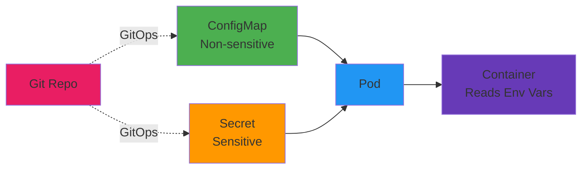

# Day 05 - Config & Secret Management

> **Goal**: Externalize configuration using ConfigMap and Secret  
> **Time**: 15 min | **Prereq**: [Day 04](day-04-kubernetes-core-refresher.md)

---

## The Concept (ONE Diagram)



**Read the diagram:**
- **ConfigMap**: Non-sensitive config (feature flags, API URLs)
- **Secret**: Sensitive data (passwords, tokens) - base64 encoded
- **Pod**: Mounts config as environment variables or volumes
- **Git**: ConfigMaps live in Git, Secrets use external manager (prod)

---

## Why Externalize Config?

**❌ Bad (Hardcoded):**
```dockerfile
ENV DATABASE_URL=postgres://prod-db:5432/myapp
ENV API_KEY=abc123xyz789
```

**Problems:**
- Rebuild image for every config change
- Secrets baked into image (security risk)
- Can't reuse image across environments

**✅ Good (External):**
```yaml
env:
- name: DATABASE_URL
  valueFrom:
    configMapKeyRef: ...
- name: API_KEY
  valueFrom:
    secretKeyRef: ...
```

**Benefits:**
- Same image across dev/staging/prod
- Config changes without rebuild
- Secrets never in image or Git

---

## ConfigMap vs Secret

| | ConfigMap | Secret |
|-|-----------|--------|
| **Purpose** | Non-sensitive config | Passwords, tokens, keys |
| **Storage** | Plain text in etcd | Base64 encoded (NOT encrypted by default) |
| **Git** | Safe to commit | ⚠️ Use Sealed Secrets or External Secrets |
| **Max size** | 1MB | 1MB |
| **Example** | `LOG_LEVEL=debug` | `DB_PASSWORD=secret123` |

---

## Step 1: Create ConfigMap

```bash
# Create working directory
mkdir -p artifacts/section-01/config-secret
cd artifacts/section-01/config-secret

# Create ConfigMap
cat > app-config.yaml << 'EOF'
apiVersion: v1
kind: ConfigMap
metadata:
  name: frontend-config
data:
  APP_THEME: "dark"
  LOG_LEVEL: "info"
  API_URL: "https://api.example.com"
  FEATURE_FLAG_NEW_UI: "true"
EOF

kubectl apply -f app-config.yaml

# Verify
kubectl get configmap frontend-config
kubectl describe configmap frontend-config
```

---

## Step 2: Create Secret

```bash
# Method 1: Imperative (safer - never in Git)
kubectl create secret generic db-credentials \
  --from-literal=username=admin \
  --from-literal=password=supersecret123 \
  --dry-run=client -o yaml > db-secret.yaml

kubectl apply -f db-secret.yaml

# Method 2: Declarative (ONLY for lab - don't commit real secrets!)
cat > db-secret.yaml << 'EOF'
apiVersion: v1
kind: Secret
metadata:
  name: db-credentials
type: Opaque
stringData:  # Plain text (auto base64 encoded)
  username: admin
  password: supersecret123
EOF

kubectl apply -f db-secret.yaml

# Verify (values are base64 encoded)
kubectl get secret db-credentials -o yaml
```

**⚠️ Production Warning:**
- Don't commit `db-secret.yaml` to Git!
- Use Sealed Secrets or External Secrets Operator
- Or use cloud secret managers (AWS Secrets Manager, GCP Secret Manager)

---

## Step 3: Inject into Deployment

```bash
# Update deployment to use ConfigMap + Secret
cat > frontend-app-v2.yaml << 'EOF'
apiVersion: apps/v1
kind: Deployment
metadata:
  name: frontend
spec:
  replicas: 2
  selector:
    matchLabels:
      app: frontend
  template:
    metadata:
      labels:
        app: frontend
    spec:
      containers:
      - name: nginx
        image: nginx:1.25-alpine
        env:
        # From ConfigMap
        - name: APP_THEME
          valueFrom:
            configMapKeyRef:
              name: frontend-config
              key: APP_THEME
        - name: LOG_LEVEL
          valueFrom:
            configMapKeyRef:
              name: frontend-config
              key: LOG_LEVEL
        # From Secret
        - name: DB_USERNAME
          valueFrom:
            secretKeyRef:
              name: db-credentials
              key: username
        - name: DB_PASSWORD
          valueFrom:
            secretKeyRef:
              name: db-credentials
              key: password
        ports:
        - containerPort: 80
EOF

kubectl apply -f frontend-app-v2.yaml
```

---

## Step 4: Verify Injection

```bash
# Get pod name
POD_NAME=$(kubectl get pods -l app=frontend -o jsonpath='{.items[0].metadata.name}')

# Check environment variables inside container
kubectl exec $POD_NAME -- env | grep -E 'APP_THEME|LOG_LEVEL|DB_PASSWORD'

# Expected output:
# APP_THEME=dark
# LOG_LEVEL=info
# DB_PASSWORD=supersecret123
```

---

## Alternative: Mount as Files

```bash
# Instead of env vars, mount ConfigMap as volume
cat > frontend-app-v3.yaml << 'EOF'
apiVersion: apps/v1
kind: Deployment
metadata:
  name: frontend
spec:
  replicas: 1
  selector:
    matchLabels:
      app: frontend
  template:
    metadata:
      labels:
        app: frontend
    spec:
      containers:
      - name: nginx
        image: nginx:1.25-alpine
        volumeMounts:
        - name: config-volume
          mountPath: /etc/config
        - name: secret-volume
          mountPath: /etc/secrets
          readOnly: true
      volumes:
      - name: config-volume
        configMap:
          name: frontend-config
      - name: secret-volume
        secret:
          secretName: db-credentials
EOF

kubectl apply -f frontend-app-v3.yaml

# Verify files created
kubectl exec $POD_NAME -- ls /etc/config
# APP_THEME  LOG_LEVEL  API_URL  FEATURE_FLAG_NEW_UI

kubectl exec $POD_NAME -- cat /etc/config/APP_THEME
# dark

kubectl exec $POD_NAME -- cat /etc/secrets/password
# supersecret123
```

---

## Env Vars vs Files

| Method | Use Case | Example |
|--------|----------|---------|
| **Env Vars** | Simple key-value config | `LOG_LEVEL=debug` |
| **Files** | Config files (JSON, YAML, properties) | `application.yaml`, `database.conf` |

**Best practice:** 
- Small values (URLs, flags) → Env vars
- Config files (complex structure) → Volumes

---

## Update ConfigMap (Live)

```bash
# Edit ConfigMap
kubectl edit configmap frontend-config
# Change LOG_LEVEL: "info" to LOG_LEVEL: "debug"

# Env vars: Requires pod restart
kubectl rollout restart deployment frontend

# Files: Auto-updates (may take 60s)
kubectl exec $POD_NAME -- cat /etc/config/LOG_LEVEL
# (Shows new value after sync)
```

---

## Production Secrets Management

### ❌ Don't Do This
```bash
# Committing secrets to Git (VERY BAD!)
git add db-secret.yaml
git commit -m "add secrets"  # ← Secrets in Git history forever!
```

### ✅ Production Solutions

**1. Sealed Secrets (Bitnami)**
- Encrypt secrets before committing to Git
- Only cluster can decrypt

**2. External Secrets Operator**
- Sync secrets from AWS Secrets Manager, Vault, etc.
- Secrets never touch Git

**3. HashiCorp Vault**
- Centralized secret storage
- Dynamic secrets, auto-rotation

**Example (External Secrets Operator):**
```yaml
apiVersion: external-secrets.io/v1beta1
kind: ExternalSecret
metadata:
  name: db-credentials
spec:
  secretStoreRef:
    name: aws-secrets-manager
  target:
    name: db-credentials
  data:
  - secretKey: password
    remoteRef:
      key: prod/database/password
```

---

## Common Issues

| Error | Fix |
|-------|-----|
| `configmap not found` | Apply ConfigMap first: `kubectl apply -f app-config.yaml` |
| `secret not found` | Apply Secret first: `kubectl apply -f db-secret.yaml` |
| `env var empty in pod` | Check key name matches exactly (case-sensitive) |
| `pod pending` | Check `kubectl describe pod` for errors |
| `mount failed` | Verify ConfigMap/Secret exists in same namespace |

---

## Operational Insights

### Configuration Drift
- Developer runs: `kubectl edit configmap frontend-config`
- Changes LOG_LEVEL manually
- Next GitOps sync overwrites change
- **Solution:** All config must go through Git PR

### Secret Rotation
- Change secret: `kubectl delete secret db-credentials && kubectl apply -f new-secret.yaml`
- Pods with env vars: Must restart (`kubectl rollout restart`)
- Pods with volumes: Auto-update (60s delay)

### Namespace Isolation
- ConfigMaps/Secrets are namespace-scoped
- Can't reference ConfigMap in namespace-a from pod in namespace-b
- **Solution:** Duplicate or use cluster-wide config (not recommended)

---

## Clean Up

```bash
kubectl delete -f frontend-app-v2.yaml
kubectl delete configmap frontend-config
kubectl delete secret db-credentials
```

---

## Next Day

→ **Day 06**: [RBAC & Namespace Design](day-06-rbac-namespace-design.md) - Control who can do what

---

## Want More?

📚 **Deep Dive**: See [Day 05 - Original](../../modules/Section-01-kubernetes-primitives/day-05-config-secret-management/)  
📖 **Resources**:
- [ConfigMap Best Practices](https://kubernetes.io/docs/concepts/configuration/configmap/)
- [Secret Management](https://kubernetes.io/docs/concepts/configuration/secret/)
- [External Secrets Operator](https://external-secrets.io/)
- [Sealed Secrets](https://github.com/bitnami-labs/sealed-secrets)

---

## Deliverables Checklist

- [ ] ConfigMap created with 4 key-value pairs
- [ ] Secret created (username + password)
- [ ] Deployment updated to inject config
- [ ] Env vars verified in pod
- [ ] Volume mount tested (optional)
- [ ] Understand production secret management
- [ ] Files committed to Git (except db-secret.yaml!)
