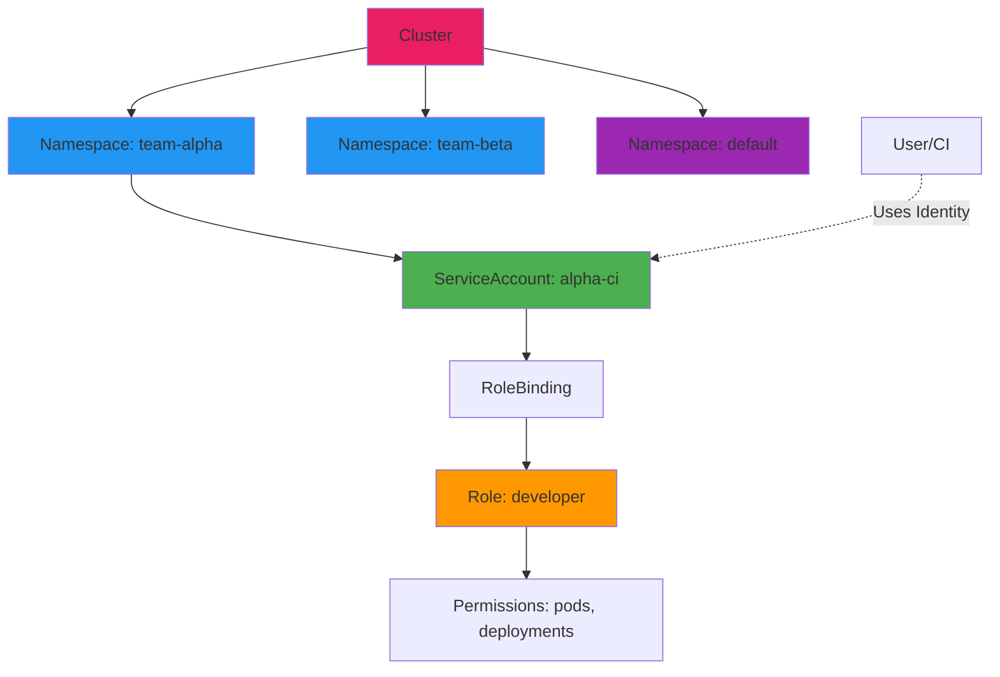

# Day 06 - RBAC & Namespace Design

  SUMMARY: What we're doing in this doc
  - Goal: build multi-tenant isolation on a shared K8s cluster using Namespaces + RBAC

  Step-by-step process:
  - Step 1 - Create Namespace: make a team-alpha namespace to logically isolate the team's resources
  - Step 2 - Define Role: scope exact permissions (pods, deployments, services, configmaps/secrets, logs); exclude Ingress
  - Step 3 - ServiceAccount + RoleBinding: create identity (ServiceAccount) and bind it to the Role
  - Step 4 - Test Permissions: use `kubectl auth can-i` to confirm allowed/denied actions match expectations
  - Step 5 - Simulate Deployment: deploy an app using the team's ServiceAccount to prove it works end-to-end
  - Bonus - ResourceQuota: cap pods/CPU/memory/PVCs per namespace to prevent resource sprawl
  - ClusterRole/ClusterRoleBinding: grant cluster-wide permissions only when truly needed
  - Clean Up: delete the namespace (cascades) or remove resources individually

  Key one-liner definitions:
  - Namespace - logical boundary partitioning cluster resources per team/env
  - ServiceAccount - identity used by pods/CI to talk to the API server
  - Role - permissions (verbs on resources) scoped to one namespace
  - RoleBinding - links a ServiceAccount/user to a Role
  - ClusterRole - same as Role but cluster-wide scope
  - ClusterRoleBinding - links identity to a ClusterRole
  - Verbs - get/list/watch/create/update/patch/delete/* define allowed actions
  - ResourceQuota - enforces hard limits on resource consumption per namespace

  Why it matters:
  - Without RBAC: everyone gets cluster-admin, shared default namespace, no blast-radius containment, no cost tracking
  - With RBAC: least privilege, isolated teams, contained blast radius, per-team cost allocation


> **Goal**: Implement multi-tenant isolation using Namespaces and RBAC  
> **Time**: 20 min | **Prereq**: [Day 05](day-05-config-secret-management.md)

---

## The Concept (ONE Diagram)



**Read the diagram:**
- **Cluster**: Single K8s cluster
- **Namespaces**: Logical boundaries (team-alpha, team-beta, default)
- **ServiceAccount**: Identity for pods or CI/CD
- **Role**: Permissions within one namespace
- **RoleBinding**: Links ServiceAccount → Role

---

## Why Namespaces + RBAC?

### Without (Shared Cluster, No Isolation)
❌ All teams in `default` namespace  
❌ Everyone has `cluster-admin`  
❌ Developer deletes wrong deployment → prod down  
❌ No cost tracking per team  

### With (Multi-tenant Isolation)
✅ Each team in own namespace  
✅ Least privilege access  
✅ Blast radius contained  
✅ Cost allocation per team  

---

## RBAC Concepts

| Resource | Scope | Purpose |
|----------|-------|---------|
| **ServiceAccount** | Namespace | Identity for pods/CI |
| **Role** | Namespace | Permissions (get, create, delete) |
| **RoleBinding** | Namespace | Links identity → role |
| **ClusterRole** | Cluster | Cluster-wide permissions |
| **ClusterRoleBinding** | Cluster | Links identity → cluster role |

**Verbs (Permissions):**
- `get` - Read one resource
- `list` - Read all resources
- `watch` - Stream updates
- `create` - Make new resources
- `update` - Modify existing (full replace)
- `patch` - Modify existing (partial update)
- `delete` - Remove resources
- `*` - All verbs (admin)

---

## Step 1: Create Team Namespace

```bash
# Create working directory
mkdir -p artifacts/section-01/rbac
cd artifacts/section-01/rbac

# Create namespace for team-alpha
cat > team-alpha-namespace.yaml << 'EOF'
apiVersion: v1
kind: Namespace
metadata:
  name: team-alpha
  labels:
    managed-by: platform-team
    team: alpha
    cost-center: engineering
EOF

kubectl apply -f team-alpha-namespace.yaml

# Verify
kubectl get namespace team-alpha
kubectl describe namespace team-alpha
```

---

## Step 2: Define Role (Permissions)

```bash
# Create Role with specific permissions
cat > team-alpha-role.yaml << 'EOF'
apiVersion: rbac.authorization.k8s.io/v1
kind: Role
metadata:
  namespace: team-alpha
  name: team-alpha-developer
rules:
# Pods & Deployments
- apiGroups: ["", "apps"]
  resources: ["pods", "deployments", "replicasets"]
  verbs: ["get", "list", "watch", "create", "update", "patch", "delete"]
# Services & ConfigMaps
- apiGroups: [""]
  resources: ["services", "configmaps", "secrets"]
  verbs: ["get", "list", "watch", "create", "update", "patch", "delete"]
# Pod logs (debugging)
- apiGroups: [""]
  resources: ["pods/log"]
  verbs: ["get", "list"]
# NOT allowed: Ingress (prevents traffic stealing)
EOF

kubectl apply -f team-alpha-role.yaml

# Verify
kubectl get role -n team-alpha
kubectl describe role team-alpha-developer -n team-alpha
```

**What this Role allows:**
- ✅ Create/delete pods, deployments
- ✅ Manage services, configmaps, secrets
- ✅ Read pod logs
- ❌ Create Ingress rules
- ❌ Access other namespaces

---

## Step 3: Create ServiceAccount + RoleBinding

```bash
# Create ServiceAccount and bind to Role
cat > team-alpha-binding.yaml << 'EOF'
apiVersion: v1
kind: ServiceAccount
metadata:
  name: alpha-ci
  namespace: team-alpha
---
apiVersion: rbac.authorization.k8s.io/v1
kind: RoleBinding
metadata:
  name: alpha-dev-binding
  namespace: team-alpha
subjects:
- kind: ServiceAccount
  name: alpha-ci
  namespace: team-alpha
roleRef:
  kind: Role
  name: team-alpha-developer
  apiGroup: rbac.authorization.k8s.io
EOF

kubectl apply -f team-alpha-binding.yaml

# Verify
kubectl get serviceaccount -n team-alpha
kubectl get rolebinding -n team-alpha
```

---

## Step 4: Test Permissions

```bash
# Test 1: Can create deployment? (Should be YES)
kubectl auth can-i create deployments \
  --namespace team-alpha \
  --as system:serviceaccount:team-alpha:alpha-ci

# Test 2: Can create ingress? (Should be NO)
kubectl auth can-i create ingress \
  --namespace team-alpha \
  --as system:serviceaccount:team-alpha:alpha-ci

# Test 3: Can delete pods in default namespace? (Should be NO)
kubectl auth can-i delete pods \
  --namespace default \
  --as system:serviceaccount:team-alpha:alpha-ci

# Test 4: Can list pods in own namespace? (Should be YES)
kubectl auth can-i list pods \
  --namespace team-alpha \
  --as system:serviceaccount:team-alpha:alpha-ci

# Show all permissions
kubectl auth can-i --list \
  --namespace team-alpha \
  --as system:serviceaccount:team-alpha:alpha-ci
```

**Expected results:**
```
create deployments: yes
create ingress: no
delete pods (default): no
list pods (team-alpha): yes
```

---

## Step 5: Simulate Team Deployment

```bash
# Deploy app as team-alpha (using default serviceaccount for now)
cat > team-alpha-app.yaml << 'EOF'
apiVersion: apps/v1
kind: Deployment
metadata:
  name: alpha-app
  namespace: team-alpha
spec:
  replicas: 2
  selector:
    matchLabels:
      app: alpha-app
  template:
    metadata:
      labels:
        app: alpha-app
    spec:
      serviceAccountName: alpha-ci  # Uses team's ServiceAccount
      containers:
      - name: nginx
        image: nginx:1.25-alpine
        ports:
        - containerPort: 80
EOF

kubectl apply -f team-alpha-app.yaml

# Verify deployment
kubectl get pods -n team-alpha
```

---

## Multi-Namespace Design Patterns

### Pattern 1: Team-per-Namespace
```
team-alpha/    (Frontend team)
team-beta/     (Backend team)
team-gamma/    (Data team)
```

### Pattern 2: Environment-per-Namespace
```
dev/
staging/
prod/
```

### Pattern 3: Hybrid (Recommended for Platform)
```
dev-team-alpha/
dev-team-beta/
staging-team-alpha/
staging-team-beta/
prod-team-alpha/
prod-team-beta/
```

---

## ClusterRole vs Role

```bash
# ClusterRole: Cluster-wide permissions
cat > cluster-viewer.yaml << 'EOF'
apiVersion: rbac.authorization.k8s.io/v1
kind: ClusterRole
metadata:
  name: cluster-viewer
rules:
- apiGroups: [""]
  resources: ["nodes", "namespaces"]
  verbs: ["get", "list"]
---
apiVersion: rbac.authorization.k8s.io/v1
kind: ClusterRoleBinding
metadata:
  name: view-nodes
subjects:
- kind: ServiceAccount
  name: alpha-ci
  namespace: team-alpha
roleRef:
  kind: ClusterRole
  name: cluster-viewer
  apiGroup: rbac.authorization.k8s.io
EOF

kubectl apply -f cluster-viewer.yaml

# Now alpha-ci can view nodes (cluster-wide)
kubectl auth can-i list nodes \
  --as system:serviceaccount:team-alpha:alpha-ci
# yes
```

**When to use ClusterRole:**
- View cluster resources (nodes, PVs)
- Create namespaces
- Platform admin operations
- Cross-namespace operations

---

## Resource Quotas (Bonus)

```bash
# Prevent resource sprawl
cat > team-alpha-quota.yaml << 'EOF'
apiVersion: v1
kind: ResourceQuota
metadata:
  name: team-alpha-quota
  namespace: team-alpha
spec:
  hard:
    pods: "20"
    requests.cpu: "4"
    requests.memory: "8Gi"
    persistentvolumeclaims: "10"
    services.loadbalancers: "2"
EOF

kubectl apply -f team-alpha-quota.yaml

# Verify
kubectl describe resourcequota team-alpha-quota -n team-alpha
```

---

## Common Issues

| Error | Fix |
|-------|-----|
| `forbidden: User cannot...` | Check RoleBinding links correct ServiceAccount |
| `role not found` | Role must exist in same namespace as RoleBinding |
| `serviceaccount not found` | Create ServiceAccount before RoleBinding |
| `auth can-i returns "no"` | Verb not in Role's `verbs` list |
| `cross-namespace access denied` | Use ClusterRole for cross-namespace |

---

## Operational Insights

### Anti-Patterns
❌ **Everyone gets cluster-admin** - "It's easier"  
❌ **Shared namespace** - All teams in `default`  
❌ **No ServiceAccounts** - Everyone uses same identity  
❌ **Manual RBAC** - `kubectl create role` per team  

### Best Practices
✅ **Least privilege** - Grant minimum permissions needed  
✅ **Namespace isolation** - One team = one namespace  
✅ **ServiceAccount per workload** - No shared identities  
✅ **GitOps RBAC** - RBAC manifests in Git  
✅ **Regular audits** - Review permissions quarterly  

### Platform Team Responsibilities
- Define RBAC templates
- Onboard teams with automation (Backstage!)
- Monitor permission escalation
- Audit namespace access logs

---

## Clean Up

```bash
# Delete namespace (deletes everything inside)
kubectl delete namespace team-alpha

# Or delete individual resources
kubectl delete -f team-alpha-app.yaml
kubectl delete -f team-alpha-binding.yaml
kubectl delete -f team-alpha-role.yaml
kubectl delete -f team-alpha-namespace.yaml
```

---

## Next Day

→ **Day 07**: [CRDs, Operators, Controllers](day-07-crds-operators-controllers.md) - Extend Kubernetes API

---

## Want More?

📚 **Deep Dive**: See [Day 06 - Original](../../modules/Section-01-kubernetes-primitives/day-06-rbac-namespace-design/)  
📖 **Resources**:
- [RBAC Documentation](https://kubernetes.io/docs/reference/access-authn-authz/rbac/)
- [Namespace Best Practices](https://kubernetes.io/docs/concepts/overview/working-with-objects/namespaces/)
- [Using RBAC Authorization](https://kubernetes.io/docs/reference/access-authn-authz/rbac/)

---

## Deliverables Checklist

- [ ] `team-alpha` namespace created
- [ ] Role `team-alpha-developer` created with specific permissions
- [ ] ServiceAccount `alpha-ci` created
- [ ] RoleBinding links ServiceAccount → Role
- [ ] Permission tests pass (`auth can-i`)
- [ ] ResourceQuota applied (optional)
- [ ] Test deployment runs in team-alpha namespace
- [ ] Combined manifest committed to Git
