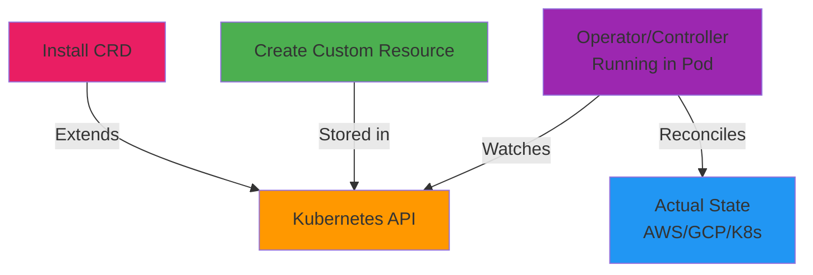
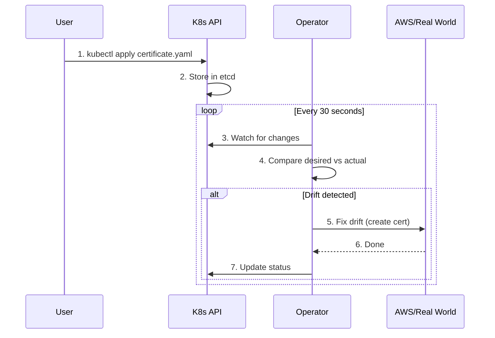

# Day 07 - CRDs, Operators, Controllers

> **Goal**: Understand how to extend Kubernetes API with Custom Resources  
> **Time**: 20 min | **Prereq**: [Day 06](day-06-rbac-namespace-design.md)

---

## The Concept (ONE Diagram)



**Read the diagram:**
- **CRD**: Teaches Kubernetes about new resource types (Certificate, Database)
- **Custom Resource**: Instance of that type (like creating a Pod)
- **Operator**: Controller that watches Custom Resources
- **Reconciliation**: Operator makes actual state match desired state

---

## The Magic Behind Platform Tools

**Everything you'll use is built on this pattern:**

| Tool | CRD | What Operator Does |
|------|-----|-------------------|
| **ArgoCD** | `Application` | Syncs Git → Kubernetes |
| **Crossplane** | `RDSInstance`, `S3Bucket` | Provisions cloud resources |
| **cert-manager** | `Certificate`, `Issuer` | Gets TLS certs from Let's Encrypt |
| **Istio** | `VirtualService`, `Gateway` | Configures service mesh |
| **Prometheus** | `ServiceMonitor`, `PrometheusRule` | Scrapes metrics |

---

## The Control Loop



**Key points:**
- Operators run in a continuous loop
- They watch the API for Custom Resources
- They reconcile actual state with desired state
- They update status back to the API

---

## Step 1: Inspect Existing CRDs

```bash
# List all Custom Resource Definitions
kubectl get crds

# Filter for cert-manager (installed on Day 01)
kubectl get crds | grep cert-manager

# Expected output:
# certificaterequests.cert-manager.io
# certificates.cert-manager.io
# challenges.acme.cert-manager.io
# clusterissuers.cert-manager.io
# issuers.cert-manager.io
# orders.acme.cert-manager.io
```

**What happened:**
- cert-manager installed 6 CRDs
- Kubernetes now understands `Certificate`, `Issuer`, etc.
- You can now `kubectl get certificates` just like `kubectl get pods`

---

## Step 2: Create a Custom Resource

```bash
# Create working directory
mkdir -p artifacts/section-01/crds
cd artifacts/section-01/crds

# Create an Issuer (cert-manager custom resource)
cat > selfsigned-issuer.yaml << 'EOF'
apiVersion: cert-manager.io/v1
kind: Issuer
metadata:
  name: selfsigned-issuer
  namespace: default
spec:
  selfSigned: {}
EOF

# Apply like any K8s resource
kubectl apply -f selfsigned-issuer.yaml

# View custom resources
kubectl get issuers
kubectl get issuer selfsigned-issuer
kubectl describe issuer selfsigned-issuer
```

**What just happened:**
- Created an `Issuer` (not a native K8s type!)
- cert-manager controller saw it
- Controller initialized the Issuer
- Status shows `Ready: True`

---

## Step 3: Use the Custom Resource

```bash
# Create a Certificate using our Issuer
cat > test-certificate.yaml << 'EOF'
apiVersion: cert-manager.io/v1
kind: Certificate
metadata:
  name: test-certificate
  namespace: default
spec:
  secretName: test-tls
  issuerRef:
    name: selfsigned-issuer
    kind: Issuer
  dnsNames:
  - example.com
  - www.example.com
EOF

kubectl apply -f test-certificate.yaml

# Watch cert-manager create the certificate
kubectl get certificate test-certificate -w
# (Ctrl+C after it shows Ready=True)

# cert-manager created a Secret with the TLS cert!
kubectl get secret test-tls
kubectl describe secret test-tls
```

**What the operator did:**
1. Saw new `Certificate` resource
2. Read `issuerRef` (which Issuer to use)
3. Generated self-signed certificate
4. Stored cert in Secret `test-tls`
5. Updated Certificate status to Ready

---

## Step 4: Watch the Controller

```bash
# Find cert-manager controller pod
kubectl get pods -n cert-manager

# Get logs (see reconciliation)
CERT_POD=$(kubectl get pods -n cert-manager \
  -l app.kubernetes.io/component=controller \
  -o jsonpath='{.items[0].metadata.name}')

kubectl logs -n cert-manager $CERT_POD | grep selfsigned-issuer

# You'll see logs like:
# "Issuer created" "reconciling Issuer"
```

---

## CRD vs Controller vs Operator

| Term | What It Is | Example |
|------|-----------|---------|
| **CRD** | Schema definition (like a class) | `certificates.cert-manager.io` |
| **Custom Resource** | Instance of that schema | Your Certificate named `test-certificate` |
| **Controller** | Code that watches and acts | cert-manager pod |
| **Operator** | Controller + domain knowledge | cert-manager (knows TLS) |

**Operator = Controller + Business Logic**

---

## Create Your Own CRD (Simple Example)

```bash
# Define a simple CRD
cat > mycrd.yaml << 'EOF'
apiVersion: apiextensions.k8s.io/v1
kind: CustomResourceDefinition
metadata:
  name: websites.example.com
spec:
  group: example.com
  names:
    kind: Website
    plural: websites
    singular: website
    shortNames:
    - ws
  scope: Namespaced
  versions:
  - name: v1
    served: true
    storage: true
    schema:
      openAPIV3Schema:
        type: object
        properties:
          spec:
            type: object
            properties:
              url:
                type: string
              replicas:
                type: integer
                minimum: 1
                maximum: 10
            required:
            - url
            - replicas
EOF

kubectl apply -f mycrd.yaml

# Now Kubernetes knows about "Website"!
kubectl get crds websites.example.com

# Create an instance
cat > my-website.yaml << 'EOF'
apiVersion: example.com/v1
kind: Website
metadata:
  name: my-blog
spec:
  url: https://myblog.com
  replicas: 3
EOF

kubectl apply -f my-website.yaml

# View your custom resource
kubectl get websites
kubectl get ws  # Using shortName
kubectl describe website my-blog
```

**Note:** This CRD has no controller, so it's just data (stored in etcd). To make it functional, you'd need to write an operator.

---

## Famous Operators in Platform Engineering

| Operator | Purpose | CRDs |
|----------|---------|------|
| **ArgoCD** | GitOps continuous delivery | Application, ApplicationSet, AppProject |
| **Crossplane** | Cloud infrastructure provisioning | XRD, Composition, Claim |
| **Prometheus Operator** | Monitoring stack | ServiceMonitor, PrometheusRule |
| **Istio** | Service mesh | VirtualService, DestinationRule, Gateway |
| **Velero** | Backup & disaster recovery | Backup, Restore, Schedule |
| **External Secrets** | Sync secrets from Vault/AWS | ExternalSecret, SecretStore |

---

## How Operators are Built

**Option 1: Kubebuilder (Go)**
```bash
kubebuilder init --domain example.com
kubebuilder create api --group webapp --version v1 --kind Website
# Generates scaffolding, you write reconciliation logic
```

**Option 2: Operator SDK**
- Supports Go, Ansible, Helm
- Easier for simpler operators

**Option 3: Controller Runtime**
- Lower-level library
- More control, more complexity

---

## Reconciliation Loop Pattern

```go
// Pseudocode of what an operator does
func Reconcile(ctx, req) {
    // 1. Fetch the custom resource
    website := GetWebsite(req.Name)
    
    // 2. Check desired vs actual state
    desired := website.Spec.Replicas
    actual := CountRunningPods(website)
    
    // 3. Reconcile drift
    if actual < desired {
        CreatePods(desired - actual)
    } else if actual > desired {
        DeletePods(actual - desired)
    }
    
    // 4. Update status
    website.Status.Ready = true
    UpdateStatus(website)
}
```

---

## Common Issues

| Error | Fix |
|-------|-----|
| `no matches for kind "Certificate"` | CRD not installed, check `kubectl get crds` |
| `validation error` | Schema mismatch, check CRD openAPIV3Schema |
| `operator not reacting` | Check operator logs: `kubectl logs -n <namespace> <operator-pod>` |
| `CRD already exists` | Delete old: `kubectl delete crd <name>` (deletes all instances!) |

---

## Operational Insights

### Why This Matters for Platform Engineering
- **Abstraction**: Devs say "I need a database", not "Create RDS, configure security groups, ..."
- **Automation**: Operator handles all the complexity
- **Consistency**: Same database CRD works across AWS/GCP/Azure
- **Self-service**: Devs create resources via YAML, no tickets

### The Operator Pattern Powers
- **Crossplane**: Infrastructure as CRDs
- **ArgoCD**: GitOps as CRDs
- **Backstage**: Uses operators behind templates
- **Service Mesh**: Istio, Linkerd
- **Observability**: Prometheus, Grafana

### Platform = Collection of Operators
Your IDP is essentially:
```
Backstage (Portal)
    ↓ creates
Custom Resources (YAML)
    ↓ watched by
Operators (ArgoCD, Crossplane)
    ↓ provision
Real Infrastructure
```

---

## Clean Up

```bash
# Delete custom resources
kubectl delete certificate test-certificate
kubectl delete issuer selfsigned-issuer
kubectl delete website my-blog

# Delete CRD (careful - deletes all instances!)
kubectl delete crd websites.example.com

# Secret is left behind, delete manually
kubectl delete secret test-tls
```

---

## Next Day

→ **Day 08**: [Cluster Add-ons](day-08-cluster-addons.md) - Essential cluster extensions

---

## Want More?

📚 **Deep Dive**: See [Day 07 - Original](../../modules/Section-01-kubernetes-primitives/day-07-crds-operators-controllers/)  
📖 **Resources**:
- [Custom Resources](https://kubernetes.io/docs/concepts/extend-kubernetes/api-extension/custom-resources/)
- [Operator Pattern](https://kubernetes.io/docs/concepts/extend-kubernetes/operator/)
- [Kubebuilder Book](https://book.kubebuilder.io/)
- [Operator SDK](https://sdk.operatorframework.io/)

---

## Deliverables Checklist

- [ ] Listed CRDs in cluster (`kubectl get crds`)
- [ ] Created Issuer custom resource
- [ ] Created Certificate using Issuer
- [ ] Verified cert-manager created Secret
- [ ] Inspected controller logs
- [ ] Created simple custom CRD
- [ ] Created instance of custom CRD
- [ ] Understand operator reconciliation pattern
- [ ] Files committed to Git
