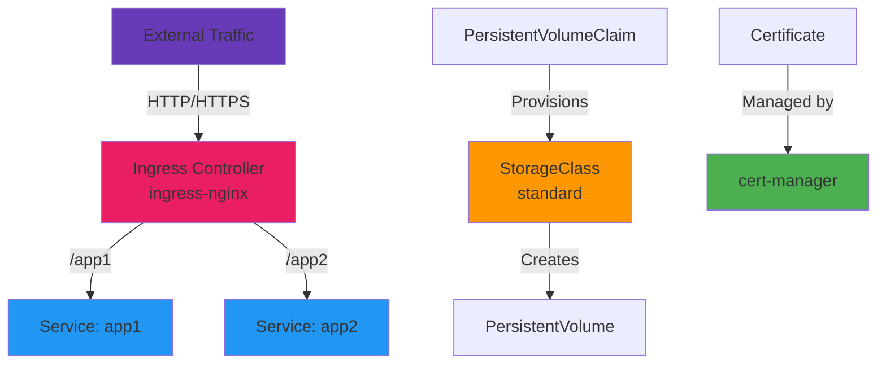

# Day 08 - Cluster Add-ons

> **Goal**: Validate essential platform services (Ingress, Storage, cert-manager)  
> **Time**: 15 min | **Prereq**: [Day 07](day-07-crds-operators-controllers.md)

---

## The Concept (ONE Diagram)



**Read the diagram:**
- **Ingress Controller**: Routes external traffic to services (path-based routing)
- **StorageClass**: Auto-provisions persistent volumes for databases
- **cert-manager**: Automated TLS certificate management

---

## The Bare Cluster Problem

**Without add-ons:**
- ❌ No external traffic routing (no Ingress)
- ❌ No persistent storage (no databases)
- ❌ No TLS certificates (no HTTPS)
- ❌ No monitoring (no observability)
- ❌ No DNS (no service discovery)

**With platform add-ons:**
- ✅ Ingress controller (traffic routing)
- ✅ StorageClass (dynamic volumes)
- ✅ cert-manager (TLS automation)
- ✅ Monitoring stack (later sections)
- ✅ DNS provider (later sections)

---

## Essential Platform Add-ons

| Add-on | Purpose | When App Teams Need It |
|--------|---------|------------------------|
| **Ingress Controller** | HTTP routing | Expose web app |
| **Storage Provisioner** | Dynamic PVs | Run database |
| **cert-manager** | TLS certificates | HTTPS/webhooks |
| **Metrics Server** | Pod metrics | Autoscaling |
| **CoreDNS** | DNS | Service discovery |
| **CNI Plugin** | Pod networking | Pod-to-pod communication |

**These are pre-installed on Day 01 ✅**

---

## Step 1: Validate Ingress Controller

```bash
# Create working directory
mkdir -p artifacts/section-01/addons
cd artifacts/section-01/addons

# Check ingress-nginx pods (installed Day 01)
kubectl get pods -n ingress-nginx

# Expected: ingress-nginx-controller pod Running

# Check ingress controller service
kubectl get svc -n ingress-nginx ingress-nginx-controller

# Expected: ClusterIP service on port 80/443
```

---

## Step 2: Validate Storage Class

```bash
# Check default storage class
kubectl get storageclass

# Expected output:
# NAME                 PROVISIONER             RECLAIMPOLICY
# standard (default)   rancher.io/local-path   Delete

# Test dynamic provisioning
cat > test-pvc.yaml << 'EOF'
apiVersion: v1
kind: PersistentVolumeClaim
metadata:
  name: test-pvc
spec:
  accessModes:
  - ReadWriteOnce
  resources:
    requests:
      storage: 1Gi
EOF

kubectl apply -f test-pvc.yaml

# Watch PVC get bound (auto-provisioned!)
kubectl get pvc test-pvc
# STATUS should be "Bound"

# See the auto-created PersistentVolume
kubectl get pv

# Clean up test
kubectl delete pvc test-pvc
```

---

## Step 3: Validate cert-manager

```bash
# Check cert-manager pods (installed Day 01)
kubectl get pods -n cert-manager

# Expected: 3 pods Running
# - cert-manager
# - cert-manager-cainjector
# - cert-manager-webhook

# Check CRDs
kubectl get crds | grep cert-manager

# Expected: certificates, issuers, clusterissuers, etc.
```

---

## Step 4: Test Path-Based Routing

```bash
# Deploy 2 apps with different responses
cat > routing-test.yaml << 'EOF'
apiVersion: apps/v1
kind: Deployment
metadata:
  name: app-apple
spec:
  replicas: 1
  selector:
    matchLabels:
      app: apple
  template:
    metadata:
      labels:
        app: apple
    spec:
      containers:
      - name: apple
        image: hashicorp/http-echo
        args: ["-text=apple"]
        ports:
        - containerPort: 5678
---
apiVersion: v1
kind: Service
metadata:
  name: apple-svc
spec:
  selector:
    app: apple
  ports:
  - port: 5678
---
apiVersion: apps/v1
kind: Deployment
metadata:
  name: app-banana
spec:
  replicas: 1
  selector:
    matchLabels:
      app: banana
  template:
    metadata:
      labels:
        app: banana
    spec:
      containers:
      - name: banana
        image: hashicorp/http-echo
        args: ["-text=banana"]
        ports:
        - containerPort: 5678
---
apiVersion: v1
kind: Service
metadata:
  name: banana-svc
spec:
  selector:
    app: banana
  ports:
  - port: 5678
---
apiVersion: networking.k8s.io/v1
kind: Ingress
metadata:
  name: fruit-ingress
  annotations:
    nginx.ingress.kubernetes.io/ssl-redirect: "false"
    nginx.ingress.kubernetes.io/rewrite-target: /
spec:
  ingressClassName: nginx
  rules:
  - http:
      paths:
      - path: /apple
        pathType: Prefix
        backend:
          service:
            name: apple-svc
            port:
              number: 5678
      - path: /banana
        pathType: Prefix
        backend:
          service:
            name: banana-svc
            port:
              number: 5678
EOF

kubectl apply -f routing-test.yaml

# Wait for pods to be ready
kubectl get pods -l app=apple
kubectl get pods -l app=banana

# Check Ingress created
kubectl get ingress fruit-ingress
```

---

## Step 5: Test Traffic Routing

```bash
# In separate terminal: Port-forward ingress controller
kubectl port-forward -n ingress-nginx svc/ingress-nginx-controller 8080:80

# In main terminal: Test routing
curl http://localhost:8080/apple
# Expected: apple

curl http://localhost:8080/banana
# Expected: banana

# Test non-existent path
curl http://localhost:8080/orange
# Expected: 404 (ingress working, no route defined)
```

**What this proves:**
- Ingress controller routes based on path
- `/apple` → apple-svc
- `/banana` → banana-svc
- Same pattern used for Backstage (/backstage) and ArgoCD (/argocd)

---

## How Ingress Works

```
External Request
    ↓
http://localhost:8080/apple
    ↓
Ingress Controller (nginx pod)
    ↓
Reads Ingress rules (fruit-ingress)
    ↓
Routes to apple-svc:5678
    ↓
Service selects app=apple pods
    ↓
Response: "apple"
```

---

## Add-on Health Check Script

```bash
# Create validation script
cat > validate-addons.sh << 'EOF'
#!/bin/bash
echo "=== Cluster Add-ons Validation ==="

# Ingress
echo -n "Ingress Controller: "
kubectl get pods -n ingress-nginx --no-headers 2>/dev/null | grep -q Running && echo "✅ Running" || echo "❌ Not running"

# Storage
echo -n "Default StorageClass: "
kubectl get sc standard &>/dev/null && echo "✅ Available" || echo "❌ Missing"

# cert-manager
echo -n "cert-manager: "
kubectl get pods -n cert-manager --no-headers 2>/dev/null | grep -c Running | grep -q 3 && echo "✅ 3 pods running" || echo "❌ Not running"

# CoreDNS
echo -n "CoreDNS: "
kubectl get pods -n kube-system -l k8s-app=kube-dns --no-headers 2>/dev/null | grep -q Running && echo "✅ Running" || echo "❌ Not running"

# Metrics Server (optional)
echo -n "Metrics Server: "
kubectl get deployment metrics-server -n kube-system &>/dev/null && echo "✅ Installed" || echo "⚠️  Not installed (optional)"

echo -e "\n✅ Core add-ons validated"
EOF

chmod +x validate-addons.sh
./validate-addons.sh
```

---

## Production Add-on Strategy

### Tier-0 (Critical - Must Never Fail)
- **Ingress Controller**: All traffic depends on it
- **CoreDNS**: Service discovery
- **CNI Plugin**: Pod networking

### Tier-1 (Essential - High Priority)
- **cert-manager**: Certificate renewal
- **Storage Provisioner**: Stateful apps
- **Metrics Server**: Autoscaling

### Tier-2 (Important - Medium Priority)
- **Monitoring Stack**: Observability
- **Logging Stack**: Debugging
- **Backup Tool**: Disaster recovery

---

## Monitoring Add-on Health

```bash
# Set up alerts for critical add-ons
cat > addon-health-check.yaml << 'EOF'
apiVersion: v1
kind: Pod
metadata:
  name: addon-healthcheck
spec:
  containers:
  - name: checker
    image: curlimages/curl:latest
    command:
    - sh
    - -c
    - |
      while true; do
        # Check ingress controller
        kubectl get pods -n ingress-nginx || echo "ALERT: Ingress down!"
        
        # Check cert-manager
        kubectl get pods -n cert-manager || echo "ALERT: cert-manager down!"
        
        sleep 60
      done
EOF
```

**Production:** Use Prometheus + Alertmanager for real monitoring

---

## Common Issues

| Error | Fix |
|-------|-----|
| `Ingress has no address` | Wait 30s, ingress controller may be starting |
| `503 Service Unavailable` | Backend pods not ready, check `kubectl get pods` |
| `404 Not Found` | Path doesn't match Ingress rules, check `kubectl get ingress -o yaml` |
| `PVC stuck in Pending` | No StorageClass or provisioner down |
| `Certificate not issued` | Check cert-manager logs: `kubectl logs -n cert-manager <pod>` |

---

## Operational Insights

### Treat Add-ons as Tier-0
- **Ingress fails** → Every app offline
- **cert-manager fails** → Certificates expire, APIs break
- **Storage fails** → Databases can't provision
- **DNS fails** → Services can't communicate

### Monitor Add-on Health
- Prometheus metrics for each add-on
- Alerts for pod restarts
- Alerts for certificate expiry
- Regular backup of add-on configs

### Version Management
- Pin add-on versions (Helm chart versions)
- Test upgrades in staging first
- Keep upgrade runbooks
- Have rollback plan

---

## Clean Up

```bash
# Remove test apps
kubectl delete -f routing-test.yaml

# Keep add-ons running (needed for Section-02)
```

---

## Next Section

→ **Day 09**: [GitOps & ArgoCD Architecture](../Section-02-argocd-foundations/day-09-gitops-argocd-architecture.md) - Start Section-02!

---

## Want More?

📚 **Deep Dive**: See [Day 08 - Original](../../modules/Section-01-kubernetes-primitives/day-08-cluster-addons/)  
📖 **Resources**:
- [Ingress Controllers](https://kubernetes.io/docs/concepts/services-networking/ingress-controllers/)
- [Storage Classes](https://kubernetes.io/docs/concepts/storage/storage-classes/)
- [cert-manager Docs](https://cert-manager.io/docs/)

---

## Deliverables Checklist

- [ ] Ingress controller validated (nginx pod running)
- [ ] StorageClass validated (dynamic provisioning works)
- [ ] cert-manager validated (3 pods running)
- [ ] Path-based routing tested (/apple, /banana)
- [ ] Health check script created
- [ ] Understand tier-0 add-on criticality
- [ ] Files committed to Git

---

**🎉 Section-01 Complete!** 

**Summary:**
- Day 04: Kubernetes Core (Deployment, Service, Ingress)
- Day 05: Config & Secrets (ConfigMap, Secret)
- Day 06: RBAC & Namespaces (Multi-tenant isolation)
- Day 07: CRDs & Operators (Extending K8s API)
- Day 08: Cluster Add-ons (Platform services)

**Next:** Section-02 ArgoCD Foundations (Days 09-14)
