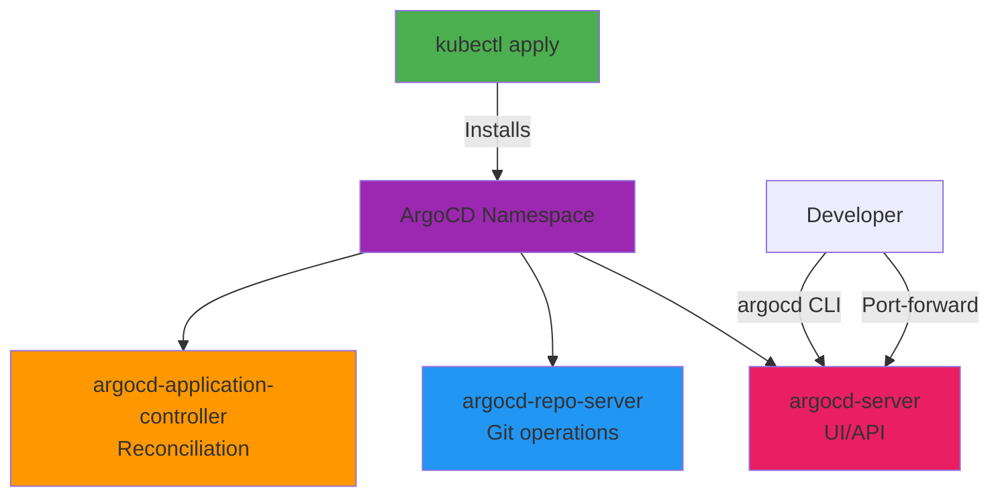

# Day 10 - ArgoCD Install & Access

> **Goal**: Install ArgoCD and access UI + CLI  
> **Time**: 15 min | **Prereq**: [Day 09](day-09-gitops-argocd-architecture.md)

---

## The Concept (ONE Diagram)



**Read the diagram:**
- **kubectl apply**: Installs ArgoCD from manifest
- **argocd namespace**: Isolated namespace for ArgoCD
- **3 core pods**: server (UI/API), repo-server (Git), controller (sync)
- **Access methods**: Port-forward for UI, argocd CLI for commands

---

## Installation Methods

| Method | Pros | Cons | When to Use |
|--------|------|------|-------------|
| **Raw Manifests** | Simple, no dependencies | Hard to customize | Lab/learning |
| **Helm Chart** | Easy upgrades, values.yaml | Requires Helm | Production |
| **Operator** | Automated management | Extra complexity | Large deployments |

**We'll use raw manifests (simplest for learning)**

---

## Step 1: Install ArgoCD

```bash
# Create working directory
mkdir -p artifacts/section-02
cd artifacts/section-02

# Create namespace
kubectl create namespace argocd

# Install ArgoCD (latest stable)
kubectl apply -n argocd -f https://raw.githubusercontent.com/argoproj/argo-cd/stable/manifests/install.yaml

# Wait for all pods to be ready (~2 min)
kubectl wait --for=condition=ready pod \
  --all \
  -n argocd \
  --timeout=300s

# Verify installation
kubectl get pods -n argocd
```

**Expected pods (7 total):**
```
NAME                                  READY   STATUS
argocd-application-controller-0       1/1     Running
argocd-applicationset-controller-xxx  1/1     Running
argocd-dex-server-xxx                 1/1     Running
argocd-notifications-controller-xxx   1/1     Running
argocd-redis-xxx                      1/1     Running
argocd-repo-server-xxx                1/1     Running
argocd-server-xxx                     1/1     Running
```

---

## Step 2: Get Admin Password

```bash
# Retrieve auto-generated admin password
kubectl -n argocd get secret argocd-initial-admin-secret \
  -o jsonpath="{.data.password}" | base64 -d

# Save to variable for later use
ARGOCD_PASSWORD=$(kubectl -n argocd get secret argocd-initial-admin-secret -o jsonpath="{.data.password}" | base64 -d)

echo "ArgoCD Admin Password: $ARGOCD_PASSWORD"

# Copy this password - you'll need it for UI login
```

**Save this password!** You'll need it for both UI and CLI login.

---

## Step 3: Access ArgoCD UI

```bash
# Port-forward ArgoCD server (in separate terminal)
kubectl port-forward svc/argocd-server -n argocd 8080:443

# Keep this terminal open!
```

**Open browser:** https://localhost:8080

**Login credentials:**
- Username: `admin`
- Password: (from Step 2)

**⚠️ Browser will warn about self-signed certificate:**
- Chrome: Click "Advanced" → "Proceed to localhost"
- Firefox: Click "Advanced" → "Accept the Risk"
- This is safe for localhost

**What you'll see:**
- ArgoCD dashboard (empty initially)
- "NEW APP" button to create applications
- Settings gear icon (top left)

---

## Step 4: Install ArgoCD CLI

```bash
# Mac (Homebrew)
brew install argocd

# Linux
curl -sSL -o argocd-linux-amd64 https://github.com/argoproj/argo-cd/releases/latest/download/argocd-linux-amd64
sudo install -m 555 argocd-linux-amd64 /usr/local/bin/argocd
rm argocd-linux-amd64

# Windows (Chocolatey)
choco install argocd-cli

# Windows (Manual download)
# Download from: https://github.com/argoproj/argo-cd/releases/latest
# Add to PATH

# Verify installation
argocd version --client
```

**Expected output:**
```
argocd: v2.9.x+...
```

---

## Step 5: Login via CLI

```bash
# Login (with password from Step 2)
argocd login localhost:8080 \
  --username admin \
  --password $ARGOCD_PASSWORD \
  --insecure

# Output: 'admin:login' logged in successfully

# Verify connection
argocd cluster list

# Expected output:
# SERVER                          NAME        VERSION  STATUS   MESSAGE
# https://kubernetes.default.svc  in-cluster  1.28     Unknown  Cluster has no applications
```

**What `argocd cluster list` shows:**
- `in-cluster`: ArgoCD's own cluster (where ArgoCD is installed)
- This is the default target for deployments

---

## Step 6: Explore ArgoCD UI

**Main sections:**
1. **Applications**: List of apps ArgoCD manages (empty now)
2. **Settings**:
   - Repositories (Git repos to watch)
   - Clusters (K8s clusters to deploy to)
   - Projects (RBAC boundaries)
   - Accounts (user management)

**Click around:**
- Settings → Repositories (empty)
- Settings → Clusters (shows in-cluster)
- Settings → Projects (shows "default" project)

---

## ArgoCD Components Explained

```bash
# Check all ArgoCD resources
kubectl get all -n argocd

# Key components:
# 1. StatefulSet: application-controller (reconciliation loop)
# 2. Deployment: server (UI + API)
# 3. Deployment: repo-server (Git cloning + manifest generation)
# 4. Deployment: redis (cache)
# 5. Deployment: dex (SSO - optional)
# 6. Deployment: notifications (Slack/email alerts)
# 7. Deployment: applicationset-controller (multi-app generator)
```

---

## CLI Quick Reference

```bash
# View version
argocd version

# List applications
argocd app list

# Get app details
argocd app get <app-name>

# Sync app manually
argocd app sync <app-name>

# View app logs
argocd app logs <app-name>

# List clusters
argocd cluster list

# List repositories
argocd repo list

# Get current context
argocd context
```

---

## Change Admin Password (Optional)

```bash
# Change from CLI
argocd account update-password \
  --current-password $ARGOCD_PASSWORD \
  --new-password MyNewPassword123

# Or via UI: Settings → Accounts → admin → Update Password
```

---

## Common Issues

| Error | Fix |
|-------|-----|
| `Pods not starting` | Wait 5 min, check `kubectl describe pod -n argocd <pod>` |
| `Can't access UI` | Check port-forward is running, use https:// not http:// |
| `Invalid password` | Re-run password command, copy carefully (no spaces) |
| `CLI connection refused` | Port-forward must be running in separate terminal |
| `Certificate error` | Use `--insecure` flag for CLI, accept in browser |

---

## Production Considerations

### Don't Use Port-Forward
```yaml
# Use Ingress instead
apiVersion: networking.k8s.io/v1
kind: Ingress
metadata:
  name: argocd-server-ingress
  namespace: argocd
  annotations:
    cert-manager.io/cluster-issuer: letsencrypt-prod
spec:
  ingressClassName: nginx
  tls:
  - hosts:
    - argocd.example.com
    secretName: argocd-tls
  rules:
  - host: argocd.example.com
    http:
      paths:
      - path: /
        pathType: Prefix
        backend:
          service:
            name: argocd-server
            port:
              number: 443
```

### Change Default Password
- Delete initial secret after first login
- Use SSO (OIDC, SAML, LDAP)
- Rotate passwords regularly

### High Availability
```bash
# Install HA version (3 replicas)
kubectl apply -n argocd -f https://raw.githubusercontent.com/argoproj/argo-cd/stable/manifests/ha/install.yaml
```

---

## Operational Insights

### Self-Managing ArgoCD
In production, ArgoCD manages itself:
1. Bootstrap: Install ArgoCD manually (once)
2. Create "argocd" Application pointing to Git repo
3. That repo contains ArgoCD's own Helm chart
4. ArgoCD upgrades itself via GitOps!

### Monitoring ArgoCD
```bash
# Check ArgoCD health
argocd admin cluster health

# View metrics (Prometheus format)
kubectl port-forward svc/argocd-metrics -n argocd 8082:8082
curl http://localhost:8082/metrics
```

### Backup Strategy
- ArgoCD stores state in Kubernetes (no external DB)
- Backup: `kubectl get applications -A -o yaml > argocd-apps-backup.yaml`
- Disaster recovery: Re-install ArgoCD, restore Applications

---

## Next Day

→ **Day 11**: [First Application Sync](day-11-first-application-sync-lifecycle.md) - Deploy your first app via GitOps

---

## Want More?

📚 **Deep Dive**: See [Day 10 - Original](../../modules/Section-02-argocd-foundations/day-10-argocd-install-access/)  
📖 **Resources**:
- [ArgoCD Installation](https://argo-cd.readthedocs.io/en/stable/getting_started/)
- [ArgoCD CLI Reference](https://argo-cd.readthedocs.io/en/stable/user-guide/commands/argocd/)
- [ArgoCD Configuration](https://argo-cd.readthedocs.io/en/stable/operator-manual/declarative-setup/)

---

## Deliverables Checklist

- [ ] ArgoCD installed (7 pods running)
- [ ] Admin password retrieved
- [ ] UI accessible at https://localhost:8080
- [ ] argocd CLI installed
- [ ] CLI login successful
- [ ] Explored UI (Applications, Settings)
- [ ] `argocd cluster list` shows in-cluster
- [ ] Installation notes committed to Git

---

**Installation Summary:**
```bash
# Quick reinstall commands (if needed)
kubectl delete namespace argocd
kubectl create namespace argocd
kubectl apply -n argocd -f https://raw.githubusercontent.com/argoproj/argo-cd/stable/manifests/install.yaml
kubectl wait --for=condition=ready pod --all -n argocd --timeout=300s
```
