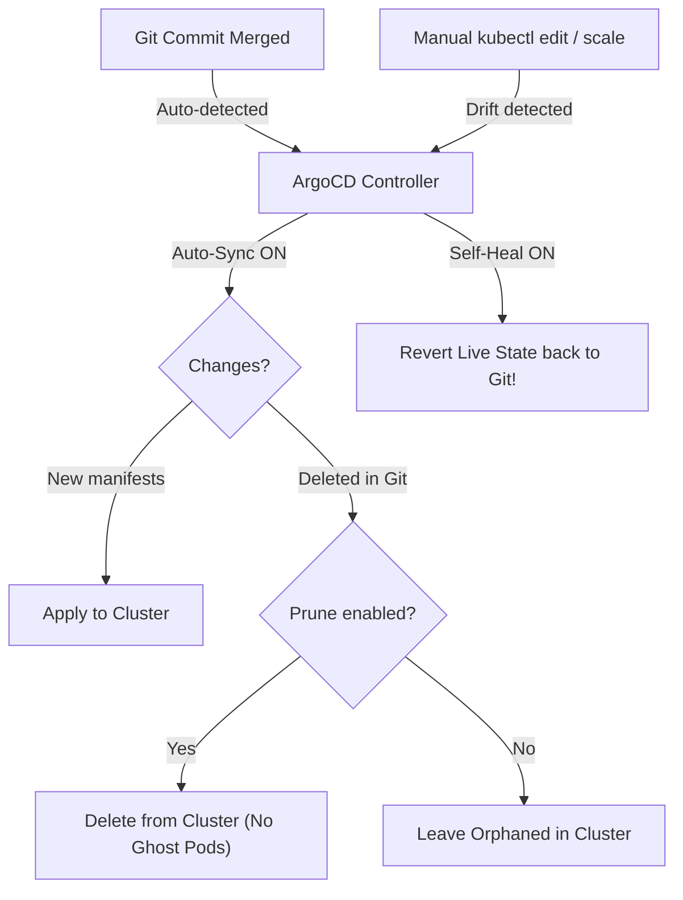

# Day 12 Student Lab Guide — Sync Policies & Automation

> **Course:** Platform Engineering Masterclass — GitOps with ArgoCD  
> **Section:** Section 02 — ArgoCD Foundations  
> **Day:** Day 12 — Sync Policies & Automation (Auto-Sync, Prune, Self-Heal)  
> **Estimated Time:** 25–35 minutes  
> **Companion Interactive Tool:** Open [`demo.html`](demo.html) in your browser for 1-click terminal commands and real-time evidence generation.  
> **Presentation Deck:** Open [`presentation.html`](presentation.html) for slide visuals.  
> **Spoken Transcript:** Read [`TRANSCRIPT.md`](TRANSCRIPT.md) or open [`transcript.html`](transcript.html).

---

## 🧭 How to Follow Along with the Video

This course uses a hands-on, pause-and-execute cadence. Follow this timeline while watching the Day 12 video lecture:

| Video Segment | Topic / Slide | Student Action |
| :--- | :--- | :--- |
| **00:00 – 01:15** | Slide 1: Welcome & Overview | Understand why manual sync does not scale in enterprise environments. |
| **01:15 – 02:30** | Slide 2: The Core Concept | Grasp the 3 independent switches: Auto-Sync, Prune, and Self-Heal. |
| **02:30 – 04:00** | Slide 3: The 4 Sync Policy Levels | Review the progressive automation levels from Manual to Full GitOps. |
| **04:00 – 05:15** | Slide 4: Policy Comparison Matrix | ⏸️ **PAUSE VIDEO** &rarr; Complete **Step 1 & Step 2** (author `guestbook-app-auto.yaml`). |
| **05:15 – 06:45** | Slide 5: Lab 1 — Enable Auto-Sync | ⏸️ **PAUSE VIDEO** &rarr; Complete **Step 3** (apply CRD and verify `Sync Policy: Automated`). |
| **06:45 – 08:15** | Slide 6: Lab 2 — Live Self-Healing Test | ⏸️ **PAUSE VIDEO** &rarr; Complete **Step 4** (scale to 5 pods and watch ArgoCD self-heal back to 1). |
| **08:15 – 09:30** | Slide 7: Lab 3 — Resource Pruning Test | ⏸️ **PAUSE VIDEO** &rarr; Complete **Step 5** (delete service and watch ArgoCD auto-recreate it). |
| **09:30 – 10:45** | Slide 8: Deep Dive — Sync Options | Review production sync options (`PruneLast`, `ApplyOutOfSyncOnly`). |
| **10:45 – 11:45** | Slide 9: Deep Dive — Retry Strategy | Understand exponential backoff and webhook tolerance. |
| **11:45 – 12:45** | Slide 10: The Hotfix Dilemma | Learn why `kubectl edit` in production is a fatal trap. |
| **12:45 – 14:30** | Slide 11–12: Culture & Wrap-Up | Complete **Step 6 & Step 7** (evidence generation in `demo.html`). |

---

## 🎯 What You Will Learn & Why It Matters

### The Operational Challenge
In Day 11, we proved that Git can declare our desired cluster state. However, our sync policy was manual:
```yaml
syncPolicy: {}
```
In real organizations with hundreds of microservices across multiple clusters:
1. **Manual sync creates deployment bottlenecks:** Developers must ping platform engineers or open web UIs to click "Sync".
2. **Cluster drift is inevitable:** Engineers inevitably run emergency `kubectl edit` or `kubectl scale` commands during incidents, leaving the live cluster out of sync with Git.
3. **Ghost infrastructure accumulates:** When services are deprecated and removed from Git, without pruning they stay alive forever in the cluster, consuming cloud resources and exposing vulnerabilities.

### The 3 GitOps Automation Switches



---

## 📋 Pre-Flight Cluster Health Check

> ✅ **Validated environment.** Every command and output below was executed on WSL2 (Ubuntu) against a `kind` cluster running Kubernetes **v1.34.0** with ArgoCD server **v3.5.3** (argocd CLI **v3.3.9**). Run all commands from your **WSL2 shell**.

```bash
# 1. Cluster and control plane are up
kubectl get nodes
kubectl get pods -n argocd

# 2. CLI has an authenticated session (required for every argocd command)
argocd version --short
```

> ⚠️ **If you completed Day 11's Step 10 teardown, `guestbook` no longer exists.** That is expected, not a failure — Day 11 deliberately ends by deleting the Application and its namespace. Running the Day 11-era pre-flight checks now returns:
> ```bash
> argocd app get guestbook
> ```
> ```text
> Error: rpc error: code = NotFound desc = applications.argoproj.io "guestbook" not found
> ```
> ```bash
> kubectl get pods -n guestbook
> ```
> ```text
> No resources found in guestbook namespace.
> ```
> **You do not need to fix anything.** Step 3 below re-creates the Application, and its `CreateNamespace=true` sync option re-creates the namespace automatically. This lab was validated starting from exactly that torn-down state.

---

## 🚀 Complete Step-by-Step Hands-on Demo

### Step 1: Prepare the Project Directory

```bash
cd artifacts/section-02/apps/guestbook
```

---

### Step 2: The Automated Application Manifest (`guestbook-app-auto.yaml`)

Here is the complete, production-grade manifest incorporating:
- `automated.prune: true`
- `automated.selfHeal: true`
- `syncOptions` (`CreateNamespace`, `PruneLast`, `ApplyOutOfSyncOnly`)
- `retry` with exponential backoff

```yaml
apiVersion: argoproj.io/v1alpha1
kind: Application
metadata:
  name: guestbook
  namespace: argocd
  finalizers:
    - resources-finalizer.argocd.argoproj.io
spec:
  project: default
  source:
    repoURL: https://github.com/argoproj/argocd-example-apps.git
    targetRevision: HEAD
    path: guestbook
  destination:
    server: https://kubernetes.default.svc
    namespace: guestbook

  # Full GitOps Automation Policy
  syncPolicy:
    automated:
      prune: true
      selfHeal: true
    syncOptions:
      - CreateNamespace=true
      - PruneLast=true
      - ApplyOutOfSyncOnly=true
    retry:
      limit: 5
      backoff:
        duration: 5s
        factor: 2
        maxDuration: 3m
```

#### ⚡ Quick 1-Step Creation (Linux / macOS / WSL):
```bash
cat << 'EOF' > guestbook-app-auto.yaml
apiVersion: argoproj.io/v1alpha1
kind: Application
metadata:
  name: guestbook
  namespace: argocd
  finalizers:
    - resources-finalizer.argocd.argoproj.io
spec:
  project: default
  source:
    repoURL: https://github.com/argoproj/argocd-example-apps.git
    targetRevision: HEAD
    path: guestbook
  destination:
    server: https://kubernetes.default.svc
    namespace: guestbook
  syncPolicy:
    automated:
      prune: true
      selfHeal: true
    syncOptions:
      - CreateNamespace=true
      - PruneLast=true
      - ApplyOutOfSyncOnly=true
    retry:
      limit: 5
      backoff:
        duration: 5s
        factor: 2
        maxDuration: 3m
EOF
```

#### ⚡ Quick 1-Step Creation (Windows PowerShell):
```powershell
@'
apiVersion: argoproj.io/v1alpha1
kind: Application
metadata:
  name: guestbook
  namespace: argocd
  finalizers:
    - resources-finalizer.argocd.argoproj.io
spec:
  project: default
  source:
    repoURL: https://github.com/argoproj/argocd-example-apps.git
    targetRevision: HEAD
    path: guestbook
  destination:
    server: https://kubernetes.default.svc
    namespace: guestbook
  syncPolicy:
    automated:
      prune: true
      selfHeal: true
    syncOptions:
      - CreateNamespace=true
      - PruneLast=true
      - ApplyOutOfSyncOnly=true
    retry:
      limit: 5
      backoff:
        duration: 5s
        factor: 2
        maxDuration: 3m
'@ | Out-File -FilePath "guestbook-app-auto.yaml" -Encoding utf8
```

---

### Step 3: Apply the Manifest & Verify the New Sync Policy

Apply the updated Application CRD to your cluster:

```bash
kubectl apply -f guestbook-app-auto.yaml
```
*Actual Output:*
```text
application.argoproj.io/guestbook created
```

> 💡 On Kubernetes 1.34+ you will also see an advisory warning about the finalizer name:
> ```text
> Warning: metadata.finalizers: "resources-finalizer.argocd.argoproj.io": prefer a
> domain-qualified finalizer name including a path (/) to avoid accidental conflicts
> ```
> **Ignore it.** The apply succeeds and cascading deletion works. ArgoCD matches that exact finalizer string, so do not rename it.

Because auto-sync is now enabled, ArgoCD syncs on its own — you never run `argocd app sync`. Give it ~30 seconds, then verify the policy:

```bash
argocd app get guestbook | grep -A4 "Sync Policy"
```

*Actual Terminal Output:*
```text
Sync Policy:        Automated (Prune)
Sync Status:        Synced to HEAD (8088f4c)
Health Status:      Healthy

GROUP  KIND        NAMESPACE  NAME          STATUS   HEALTH   HOOK  MESSAGE
```

Confirm the namespace was created by the sync option rather than by hand:
```bash
argocd app get guestbook | grep Namespace
```
```text
       Namespace              guestbook     Running  Synced         namespace/guestbook created
```

> 📌 `argocd app list` renders the same policy in an abbreviated column — it reads `Auto-Prune`, not `Automated (Prune)`:
> ```bash
> argocd app list
> ```
> ```text
> NAME              CLUSTER                         NAMESPACE  PROJECT  STATUS  HEALTH   SYNCPOLICY
> argocd/guestbook  https://kubernetes.default.svc  guestbook  default  Synced  Healthy  Auto-Prune
> ```

---

### Step 4: Test Live Self-Healing (Drift Simulation)

Now let's simulate an unauthorized manual edit to the cluster:

#### 1. Imperatively scale the deployment to 5 replicas:
```bash
kubectl scale deployment guestbook-ui -n guestbook --replicas=5
```

#### 2. Immediately inspect the live pods:
```bash
kubectl get pods -n guestbook
```
You will briefly see 5 pods creating/running.

#### 3. Watch ArgoCD detect the drift and self-heal:
ArgoCD compares Git (`replicas: 1`) against live state (`replicas: 5`). Because `selfHeal: true` is enabled, it scales the deployment back down automatically.

> ⏱️ **Measured on ArgoCD v3.5.3: self-heal completed in 1–3 seconds** across repeated runs (1s and 3s on two separate attempts). Earlier versions of this lab said "5 to 15 seconds" — modern ArgoCD reacts to the watch event almost immediately. Expect a small run-to-run spread: the elapsed time depends on where in the controller's reconcile cycle your `kubectl scale` happens to land, so do not treat any single figure as a fixed constant. If you type the next command by hand you will likely *miss* the terminating pods entirely.

Rather than racing it manually, measure it:
```bash
kubectl scale deployment guestbook-ui -n guestbook --replicas=5
start=$(date +%s)
for i in $(seq 1 40); do
  n=$(kubectl get deploy guestbook-ui -n guestbook -o jsonpath="{.spec.replicas}")
  if [ "$n" = "1" ]; then echo "SELF-HEALED after $(( $(date +%s) - start ))s"; break; fi
  sleep 2
done
kubectl get pods -n guestbook
```

*Actual Terminal Output:*
```text
deployment.apps/guestbook-ui scaled
SELF-HEALED after 1s
NAME                            READY   STATUS        RESTARTS   AGE
guestbook-ui-84774bdc6f-5b48m   1/1     Terminating   0          2s
guestbook-ui-84774bdc6f-8gpqx   1/1     Terminating   0          2s
guestbook-ui-84774bdc6f-d6kbz   1/1     Terminating   0          2s
guestbook-ui-84774bdc6f-wjtwf   1/1     Terminating   0          2s
guestbook-ui-84774bdc6f-zwg44   1/1     Running       0          42s
```
The four unauthorized pods are terminated and the original pod (age `42s`) survives. Live state snapped back to Git.

> 🔑 **The signal to watch is `spec.replicas` on the Deployment, not the pod list.** ArgoCD reverts the Deployment spec; the pods terminating are Kubernetes reacting to that. Confirm the authoritative value directly:
> ```bash
> kubectl get deploy guestbook-ui -n guestbook -o jsonpath="{.spec.replicas}"; echo
> ```
> ```text
> 1
> ```

---

### Step 5: Test Resource Pruning & Re-creation

What happens if someone deletes an entire Kubernetes resource imperatively?

#### 1. Delete the guestbook service:
```bash
kubectl delete svc guestbook-ui -n guestbook
```

#### 2. Check the service status immediately:
ArgoCD notices the service is declared in Git but missing in Kubernetes, and recreates it. Measure it the same way:

```bash
kubectl delete svc guestbook-ui -n guestbook
start=$(date +%s)
for i in $(seq 1 40); do
  if kubectl get svc guestbook-ui -n guestbook >/dev/null 2>&1; then
    echo "SERVICE RECREATED after $(( $(date +%s) - start ))s"; break
  fi
  sleep 2
done
kubectl get svc -n guestbook
```

*Actual Terminal Output:*
```text
service "guestbook-ui" deleted from guestbook namespace
SERVICE RECREATED after 3s
NAME           TYPE        CLUSTER-IP      EXTERNAL-IP   PORT(S)   AGE
guestbook-ui   ClusterIP   10.96.234.93    <none>        80/TCP    3s
```

> 📌 **Your `CLUSTER-IP` will differ.** `kind` allocates Service IPs from `10.96.0.0/16`, so expect something like `10.96.x.y` — not the `10.108.x.y` range you may see in older screenshots from other cluster types. The value that matters is the `AGE` column: a few seconds old proves the object is brand new, i.e. ArgoCD recreated it rather than the delete silently failing.
>
> ⏱️ **Recreation took 2–3 seconds** across repeated runs. As with the self-heal timing above, expect a small run-to-run spread rather than a fixed number.
>
> 📌 **Note the delete message.** On kubectl **v1.34** the output is `service "guestbook-ui" deleted from guestbook namespace`. Older kubectl versions printed just `service "guestbook-ui" deleted` without the trailing namespace clause — if your output looks shorter, you are on an older client, not seeing a different behaviour.

#### 3. How Pruning works when deleting from Git:
When you delete a YAML file from your Git repository:
- With `prune: true`, ArgoCD immediately deletes the matching object in Kubernetes.
- Without `prune: true`, the object remains orphaned forever in your cluster.

---

### Step 6: Production Sync Options & Retry Verification

Let's review the production options configured in our manifest:

| Option | Setting | Production Benefit |
| :--- | :--- | :--- |
| `CreateNamespace` | `true` | Eliminates manual namespace provisioning tickets. |
| `PruneLast` | `true` | Guarantees zero-downtime during rolling updates by waiting for new pods to be healthy before deleting old ones. |
| `ApplyOutOfSyncOnly` | `true` | Minimizes Kubernetes API load by skipping unchanged objects. |
| `retry.limit` | `5` | Handles temporary admission webhook or network timeouts automatically. |
| `retry.backoff` | `5s / factor 2 / max 3m` | Prevents denial-of-service on the API server during cluster congestion. |

---

### Step 7: The Production Hotfix Dilemma

#### Why `kubectl edit` in production is a fatal anti-pattern:
1. **The Scenario:** At 3:00 AM, an engineer notices high memory usage and runs `kubectl edit deployment` to raise memory limits.
2. **The Trap:** The outage stops, but the change was never committed to Git.
3. **The Regression:** The next morning, a developer merges a completely unrelated documentation or feature PR. ArgoCD syncs the Git repository and overwrites the live memory limits back to the old, low value. **The 3:00 AM outage returns!**
4. **The GitOps Rule:** Always commit your hotfix to Git first. A 30-second pull request and auto-sync guarantees the fix is documented, approved, and permanent.

---

## 🚨 Self-Service Troubleshooting Clinic

### 1. Error: `SelfHeal` not reverting drift
* **Root Cause:** In the Application CRD, `selfHeal` must be nested directly under `spec.syncPolicy.automated`. If `automated` is missing, `selfHeal` has no effect.
* **Fix:** Check your YAML indentation:
  ```yaml
  syncPolicy:
    automated:
      selfHeal: true
  ```

### 2. Error: ArgoCD takes up to 3 minutes to auto-sync Git commits
* **Root Cause:** By default, the ArgoCD repo-server polls Git repositories every 3 minutes.
* **Instant Fix:** To trigger an immediate reconciliation without waiting for the polling loop, run:
  ```bash
  argocd app get guestbook --refresh
  ```
* **Production Fix:** Configure a GitHub or GitLab Webhook so ArgoCD receives push notifications in real time.

### 3. Error: Service deletion causes continuous recreation loop
* **Root Cause:** If a resource is deleted imperatively in Kubernetes but still exists in Git, ArgoCD will continuously restore it.
* **Fix:** If you genuinely want to delete a resource, delete it from the Git repository!

---

## 📝 Quick Reference Command Cheat Sheet

```bash
# Apply automated sync policy
kubectl apply -f guestbook-app-auto.yaml

# Verify sync policy status
argocd app get guestbook | grep -A4 "Sync Policy"

# Drift testing commands
kubectl scale deployment guestbook-ui -n guestbook --replicas=5
kubectl get pods -n guestbook -w
kubectl delete svc guestbook-ui -n guestbook
kubectl get svc -n guestbook

# Force immediate refresh
argocd app get guestbook --refresh
```

---

## 📦 Deliverable & Evidence Submission

1. Ensure `guestbook-app-auto.yaml` is saved in `artifacts/section-02/apps/guestbook/`.
2. Open [`demo.html`](demo.html) in your browser.
3. Fill in your observations in the **Day 12 Evidence Generator** form.
4. Click **⬇️ Download .md** to save `day-12-evidence.md`.
5. Commit your work:
   ```bash
   git add artifacts/section-02/apps/guestbook/guestbook-app-auto.yaml
   git commit -m "feat(day12): complete sync policies and automation lab"
   ```

---
*Ready for Day 13? In the next module, we will explore **Git Source Patterns: Raw Manifests, Helm Charts, and Kustomize Overlays**!*
