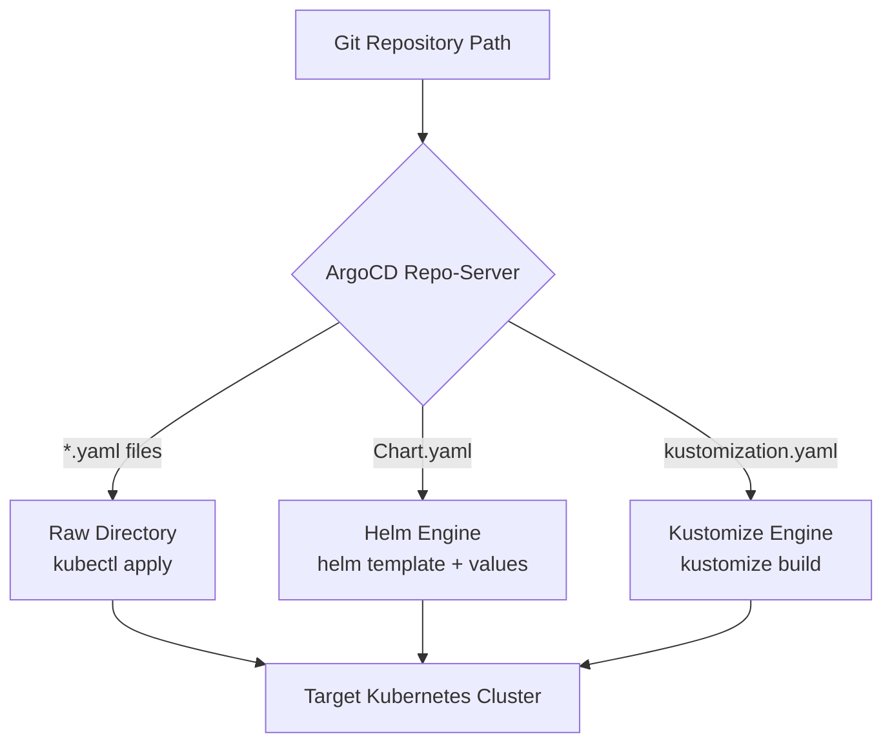

# Day 13 Student Lab Guide — Git Source Patterns (Raw, Helm, Kustomize, Multiple Sources)

> **Course:** Platform Engineering Masterclass — GitOps with ArgoCD  
> **Section:** Section 02 — ArgoCD Foundations  
> **Day:** Day 13 — Git Source Patterns (Raw YAML, Helm Packaging, Kustomize Overlays, Multiple Sources)  


---

## 🎯 What You Will Learn & Why It Matters

In enterprise Kubernetes environments, you will never encounter an organization that uses only plain YAML.
- **Third-Party Infrastructure Software** (Ingress NGINX, Cert-Manager, Prometheus, Grafana, OpenTelemetry) is packaged and maintained upstream as **Helm Charts**.
- **Internal Microservices** (Java, Node.js, Go, Python backends) are maintained across multiple environments (Dev, Staging, QA, Prod) using **Kustomize Overlays** to avoid code duplication.
- **Cluster Singletons** (Namespaces, RBAC, NetworkPolicies) are maintained as **Raw YAML**.

ArgoCD is designed from the ground up to be **tool-agnostic**. The ArgoCD repo-server compiles all three formats into standard Kubernetes YAML before submitting them to the Kubernetes API server.



---

## 📋 Pre-Flight Cluster Health Check

> ✅ **Validated environment.** Every command and output below was executed on WSL2 (Ubuntu 24.04) against a `kind` cluster (Kubernetes **v1.37.0-rc.1**), kubectl **v1.36.4** with built-in Kustomize **v5.8.1**, ArgoCD server **v3.5.3** and argocd CLI **v3.5.1**. Run all commands from your **WSL2 shell**, not from PowerShell.

Confirm your cluster is ready:

```bash
kubectl get nodes
kubectl get pods -n argocd
```

You also need a logged-in `argocd` CLI session. Every `argocd` command below fails without one. If you closed your terminal since Day 11 or 12, log in again:

```bash
kubectl port-forward svc/argocd-server -n argocd 8080:443 > /tmp/pf.log 2>&1 &
PW=$(kubectl -n argocd get secret argocd-initial-admin-secret -o jsonpath="{.data.password}" | base64 -d)
argocd login localhost:8080 --username admin --password "$PW" --insecure --grpc-web
```
*Actual Output:*
```text
'admin:login' logged in successfully
Context 'localhost:8080' updated
```

> ⚠️ If you see `dial tcp 127.0.0.1:8080: connect: connection refused`, the port-forward is not running. Run the `kubectl port-forward` line again.

---

## 🚀 Complete Step-by-Step Hands-on Lab

> 📋 **Every YAML file in this lab is created with a copy-paste `cat << 'EOF'` block.** Copy the whole block (from `cat` to `EOF`) and paste it into your terminal. The quotes around `'EOF'` stop the shell from changing anything inside, such as `$values` in Step 7.

### Step 1: Create the Lab Folder

All Day 13 files live in `~/argocd`. Every command below runs from this folder.

```bash
mkdir -p ~/argocd/apps
cd ~/argocd
```

---

### Step 2: Pattern 1 — Raw YAML (`guestbook-app.yaml`)

This is the plain folder pattern from Day 11. `path: guestbook` contains only a Deployment and a Service, with no `Chart.yaml` and no `kustomization.yaml`, so ArgoCD applies the files as they are.

```bash
mkdir -p ~/argocd/apps/guestbook
cat << 'EOF' > ~/argocd/apps/guestbook/guestbook-app.yaml
apiVersion: argoproj.io/v1alpha1
kind: Application
metadata:
  name: guestbook
  namespace: argocd
  finalizers:
    - resources-finalizer.argocd.argoproj.io
spec:
  project: default
  source:
    repoURL: https://github.com/argoproj/argocd-example-apps.git
    targetRevision: HEAD
    path: guestbook
  destination:
    server: https://kubernetes.default.svc
    namespace: guestbook
  syncPolicy:
    syncOptions:
      - CreateNamespace=true
EOF
```

If you already have the `guestbook` app from Day 11/12, **skip the apply** and just inspect it. Otherwise, create and sync it (this manifest has no auto-sync, so we sync by hand):

```bash
# Only if 'guestbook' does not exist yet:
kubectl apply -f apps/guestbook/guestbook-app.yaml
argocd app sync guestbook
```

Inspect it:
```bash
argocd app get guestbook
```
*Actual Output (bottom part):*
```text
Sync Status:        Synced to HEAD (8088f4c)
Health Status:      Healthy

GROUP  KIND        NAMESPACE  NAME          STATUS  HEALTH   HOOK  MESSAGE
       Service     guestbook  guestbook-ui  Synced  Healthy        service/guestbook-ui created
apps   Deployment  guestbook  guestbook-ui  Synced  Healthy
```

Two plain files, one Deployment and one Service. Simple, but if Dev needs 2 replicas and Prod needs 10, you would have to copy the files. That is the problem Helm and Kustomize solve.

---

### Step 3: Pattern 2 — The Helm Application (`helm-guestbook-app.yaml`)

`path: helm-guestbook` contains a `Chart.yaml`, so ArgoCD runs `helm template`. We override two chart values right inside the Application:

```bash
cat << 'EOF' > ~/argocd/apps/helm-guestbook-app.yaml
apiVersion: argoproj.io/v1alpha1
kind: Application
metadata:
  name: helm-guestbook
  namespace: argocd
  finalizers:
    - resources-finalizer.argocd.argoproj.io
spec:
  project: default
  source:
    repoURL: https://github.com/argoproj/argocd-example-apps.git
    targetRevision: HEAD
    path: helm-guestbook
    helm:
      releaseName: helm-guestbook
      parameters:
        - name: service.type
          value: ClusterIP
        - name: replicaCount
          value: "2"
  destination:
    server: https://kubernetes.default.svc
    namespace: guestbook-helm
  syncPolicy:
    automated:
      prune: true
      selfHeal: true
    syncOptions:
      - CreateNamespace=true
EOF
```

---

### Step 4: Deploy & Inspect the Helm Application

#### 1. Apply the Helm Application:
```bash
kubectl apply -f apps/helm-guestbook-app.yaml
```
*Actual Output:*
```text
application.argoproj.io/helm-guestbook created
```

> 💡 Kubernetes may also print `Warning: metadata.finalizers: "resources-finalizer.argocd.argoproj.io": prefer a domain-qualified finalizer name including a path (/)`. Ignore it. The apply succeeds, and ArgoCD matches that exact finalizer string, so do not rename it.

Auto-sync is on in this manifest, so ArgoCD deploys on its own. Wait for it instead of guessing:
```bash
argocd app wait helm-guestbook --sync --health --timeout 180
```
The last lines should say `Sync Status: Synced to HEAD` and `Health Status: Healthy`.

#### 2. Preview the Rendered Manifests:
This shows the exact YAML that `helm template` produced:
```bash
argocd app manifests helm-guestbook | head -n 40
```

*Actual Output:*
```yaml
---
apiVersion: v1
kind: Service
metadata:
  annotations:
    argocd.argoproj.io/tracking-id: helm-guestbook:/Service:guestbook-helm/helm-guestbook
  labels:
    app: helm-guestbook
    chart: helm-guestbook-0.1.0
    heritage: Helm
    release: helm-guestbook
  name: helm-guestbook
  namespace: guestbook-helm
spec:
  ports:
  - name: http
    port: 80
    protocol: TCP
    targetPort: http
  selector:
    app: helm-guestbook
    release: helm-guestbook
  type: ClusterIP

---
apiVersion: apps/v1
kind: Deployment
metadata:
  annotations:
    argocd.argoproj.io/tracking-id: helm-guestbook:apps/Deployment:guestbook-helm/helm-guestbook
  labels:
    app: helm-guestbook
    chart: helm-guestbook-0.1.0
    heritage: Helm
    release: helm-guestbook
  name: helm-guestbook
  namespace: guestbook-helm
spec:
  replicas: 2
  revisionHistoryLimit: 3
```

What to notice. These lines prove the Helm engine actually ran:
- `heritage: Helm` and `chart: helm-guestbook-0.1.0` are **Helm-generated labels**. Raw-YAML applications never have them.
- `release: helm-guestbook` comes from our `helm.releaseName`.
- `replicas: 2` comes from our `replicaCount` parameter (the chart default is `1`).
- `argocd.argoproj.io/tracking-id` is added by ArgoCD so it knows which Application owns each object.

#### 3. Verify the Pods and Service:
```bash
kubectl get pods -n guestbook-helm
kubectl get svc -n guestbook-helm
```
*Actual Output:*
```text
NAME                              READY   STATUS    RESTARTS   AGE
helm-guestbook-76b49d86b6-46rrh   1/1     Running   0          42s
helm-guestbook-76b49d86b6-96hgq   1/1     Running   0          42s

NAME             TYPE        CLUSTER-IP     EXTERNAL-IP   PORT(S)   AGE
helm-guestbook   ClusterIP   10.96.63.223   <none>        80/TCP    42s
```
Exactly 2 pods are running, matching our `replicaCount: "2"` override.

> 📌 **Pod names end with random letters, so yours will be different.** This chart names its Deployment after the release only (`helm-guestbook`), so pods are `helm-guestbook-<replicaset-hash>-<suffix>`. The two-pod count is what you are checking. Your `CLUSTER-IP` will also differ.

> 📌 **About `service.type`:** the chart's own default is already `ClusterIP`, so this parameter shows *how* to override a value rather than changing the result. Try `value: NodePort`, re-apply, and watch `TYPE` change.

---

### Step 5: Pattern 3 — The Kustomize Application (`kustomize-guestbook-app.yaml`)

`path: kustomize-guestbook` contains a `kustomization.yaml`, so ArgoCD runs `kustomize build`. We add `namePrefix: dev-` to rename every resource, without touching the files in Git:

```bash
cat << 'EOF' > ~/argocd/apps/kustomize-guestbook-app.yaml
apiVersion: argoproj.io/v1alpha1
kind: Application
metadata:
  name: kustomize-guestbook
  namespace: argocd
  finalizers:
    - resources-finalizer.argocd.argoproj.io
spec:
  project: default
  source:
    repoURL: https://github.com/argoproj/argocd-example-apps.git
    targetRevision: HEAD
    path: kustomize-guestbook
    kustomize:
      namePrefix: dev-
  destination:
    server: https://kubernetes.default.svc
    namespace: guestbook-kustomize
  syncPolicy:
    automated:
      prune: true
      selfHeal: true
    syncOptions:
      - CreateNamespace=true
EOF
```

---

### Step 6: Deploy & Inspect the Kustomize Application

#### 1. Apply and wait:
```bash
kubectl apply -f apps/kustomize-guestbook-app.yaml
argocd app wait kustomize-guestbook --sync --health --timeout 180
```
*Actual Output (first line):*
```text
application.argoproj.io/kustomize-guestbook created
```

#### 2. Verify the generated resources:
```bash
kubectl get all -n guestbook-kustomize
```

*Actual Output:*
```text
NAME                                    READY   STATUS    RESTARTS   AGE
pod/dev-guestbook-ui-6d476cf4df-kmb59   1/1     Running   0          42s

NAME                       TYPE        CLUSTER-IP      EXTERNAL-IP   PORT(S)   AGE
service/dev-guestbook-ui   ClusterIP   10.96.243.196   <none>        80/TCP    42s

NAME                               READY   UP-TO-DATE   AVAILABLE   AGE
deployment.apps/dev-guestbook-ui   1/1     1            1           42s

NAME                                          DESIRED   CURRENT   READY   AGE
replicaset.apps/dev-guestbook-ui-6d476cf4df   1         1         1       42s
```
Every resource name starts with `dev-`, and no base YAML file in the upstream repository was changed.

> 📌 **Sanity check:** the ReplicaSet hash `6d476cf4df` is the same as the one from the raw `guestbook` app (`kubectl get rs -n guestbook`). `namePrefix` renames objects but does not change the pod template, so the hash stays the same. The overlay changed only the names.

#### 3. See the rendered names:
```bash
argocd app manifests kustomize-guestbook | grep "name: dev-"
```
*Actual Output:*
```text
  name: dev-guestbook-ui
  name: dev-guestbook-ui
```

#### 4. Confirm all three patterns live side by side:
```bash
argocd app list
```
*Actual Output (trailing columns trimmed to fit):*
```text
NAME                        CLUSTER                         NAMESPACE            PROJECT  STATUS  HEALTH   SYNCPOLICY
argocd/guestbook            https://kubernetes.default.svc  guestbook            default  Synced  Healthy  Auto-Prune
argocd/helm-guestbook       https://kubernetes.default.svc  guestbook-helm       default  Synced  Healthy  Auto-Prune
argocd/kustomize-guestbook  https://kubernetes.default.svc  guestbook-kustomize  default  Synced  Healthy  Auto-Prune
```
All three rows use the same `REPO` (`https://github.com/argoproj/argocd-example-apps.git`) with `PATH` values `guestbook`, `helm-guestbook` and `kustomize-guestbook`. **One repository, three source patterns, zero ArgoCD configuration changes.** That is what "tool-agnostic" means.

> ℹ️ Your `guestbook` row may say `Manual` instead of `Auto-Prune`, depending on which Day 11/12 manifest you applied last.

---

### Step 7: Multiple Sources — Chart From One Place, Settings From Another (ArgoCD 2.6+)

One app can read from **two places at once**:
- **Source 1:** the official **podinfo Helm chart**, from its Helm repo (the recipe).
- **Source 2:** a **Git repo holding the settings file** `charts/podinfo/values-prod.yaml` (your note). In real life, this is your company repo.

`ref: values` gives Source 2 a nickname. `$values/...` in Source 1 means "look inside that repo".

```bash
cat << 'EOF' > ~/argocd/apps/multi-source-podinfo-app.yaml
apiVersion: argoproj.io/v1alpha1
kind: Application
metadata:
  name: podinfo-multi-source
  namespace: argocd
  finalizers:
    - resources-finalizer.argocd.argoproj.io
spec:
  project: default
  sources:
    # Source 1: the official chart, from podinfo's Helm repo (the recipe)
    - repoURL: https://stefanprodan.github.io/podinfo
      chart: podinfo
      targetRevision: 6.15.0
      helm:
        releaseName: podinfo
        valueFiles:
          # use the settings file from Source 2
          - $values/charts/podinfo/values-prod.yaml
        parameters:
          # values-prod.yaml turns on an HPA, which needs metrics-server.
          # Turn it off so the demo is Healthy on a plain kind cluster.
          - name: hpa.enabled
            value: "false"

    # Source 2: the settings repo (your note). In real life, this is your company repo.
    - repoURL: https://github.com/stefanprodan/podinfo.git
      targetRevision: master
      ref: values   # nickname used above as $values
  destination:
    server: https://kubernetes.default.svc
    namespace: podinfo
  syncPolicy:
    automated:
      prune: true
      selfHeal: true
    syncOptions:
      - CreateNamespace=true
EOF
```

#### 1. Apply and wait:
```bash
kubectl apply -f apps/multi-source-podinfo-app.yaml
argocd app wait podinfo-multi-source --sync --health --timeout 240
argocd app get podinfo-multi-source
```
*Actual Output (key part):*
```text
Sources:
- Repo:             https://stefanprodan.github.io/podinfo
  Target:           6.15.0
  Helm Values:      $values/charts/podinfo/values-prod.yaml
- Repo:             https://github.com/stefanprodan/podinfo.git
  Target:           master
  Ref:              values
SyncWindow:         Sync Allowed
Sync Policy:        Automated (Prune)
Sync Status:        Synced to 6.15.0
Health Status:      Healthy

GROUP  KIND        NAMESPACE  NAME           STATUS   HEALTH   HOOK  MESSAGE
       Namespace              podinfo        Running  Synced         namespace/podinfo created
       ConfigMap   podinfo    podinfo-redis  Synced                  configmap/podinfo-redis created
       Service     podinfo    podinfo        Synced   Healthy        service/podinfo created
       Service     podinfo    podinfo-redis  Synced   Healthy        service/podinfo-redis created
apps   Deployment  podinfo    podinfo        Synced   Healthy        deployment.apps/podinfo created
apps   Deployment  podinfo    podinfo-redis  Synced   Healthy        deployment.apps/podinfo-redis created
```
Notice it says **`Sources:`** (plural), with two repos listed.

#### 2. Prove the settings file from Source 2 was really used:
The chart's default values do **not** add Redis or memory limits. `values-prod.yaml` does. If you see both, ArgoCD read the file from the second repo.
```bash
kubectl get deploy -n podinfo
kubectl get deploy podinfo -n podinfo -o jsonpath='{.spec.template.spec.containers[0].resources}'; echo
```
*Actual Output:*
```text
NAME            READY   UP-TO-DATE   AVAILABLE   AGE
podinfo         1/1     1            1           95s
podinfo-redis   1/1     1            1           95s
{"limits":{"memory":"256Mi"},"requests":{"cpu":"100m","memory":"64Mi"}}
```

> 💡 **Why the `hpa.enabled: "false"` parameter?** `values-prod.yaml` turns on a HorizontalPodAutoscaler, which needs `metrics-server`. A plain `kind` cluster doesn't have it, so the HPA would never become Healthy. `parameters` always win over `valueFiles`, so this one line switches it off. It also shows that you can layer overrides: chart defaults → values file → parameters.

> 🔄 **Upgrading later?** Change only `targetRevision: 6.15.0` in Source 1. Your settings file stays the same.

---

### Step 8: Troubleshooting Lab — Break It, Then Fix It

This app has a typo **on purpose**: `path: helm-guestbok` (missing an "o"). ArgoCD cannot find `Chart.yaml`, so it cannot render anything.

```bash
cat << 'EOF' > ~/argocd/apps/broken-helm-app.yaml
# Troubleshooting demo: this app is broken ON PURPOSE.
# The path has a typo (helm-guestbok instead of helm-guestbook),
# so ArgoCD cannot find Chart.yaml and cannot render the manifests.
apiVersion: argoproj.io/v1alpha1
kind: Application
metadata:
  name: broken-helm
  namespace: argocd
  finalizers:
    - resources-finalizer.argocd.argoproj.io
spec:
  project: default
  source:
    repoURL: https://github.com/argoproj/argocd-example-apps.git
    targetRevision: HEAD
    path: helm-guestbok   # <-- typo on purpose
  destination:
    server: https://kubernetes.default.svc
    namespace: broken-helm
  syncPolicy:
    syncOptions:
      - CreateNamespace=true
EOF
```

#### 1. Apply the broken app and read the error:
```bash
kubectl apply -f apps/broken-helm-app.yaml
sleep 10
argocd app get broken-helm
```
*Actual Output (key part):*
```text
Sync Status:        Unknown
Health Status:      Healthy

CONDITION        MESSAGE
ComparisonError  Failed to load target state: failed to generate manifest for source 1 of 1: rpc error: code = Unknown desc = helm-guestbok: app path does not exist
```
`Sync Status: Unknown` plus a `ComparisonError` means the **repo-server** failed to render the manifests. Nothing reached the cluster. The message tells you exactly what's wrong.

#### 2. Fix the typo, re-apply, and sync:
```bash
sed -i 's|path: helm-guestbok .*|path: helm-guestbook|' apps/broken-helm-app.yaml
kubectl apply -f apps/broken-helm-app.yaml
argocd app sync broken-helm
argocd app wait broken-helm --health --timeout 180
argocd app list | grep -E "NAME|broken"
```
*Actual Output (last command, trailing columns trimmed):*
```text
NAME                 CLUSTER                         NAMESPACE    PROJECT  STATUS  HEALTH   SYNCPOLICY  CONDITIONS
argocd/broken-helm   https://kubernetes.default.svc  broken-helm  default  Synced  Healthy  Manual      <none>
```
The condition is gone and the app is `Synced` / `Healthy`.

> 💡 **Bonus:** `argocd app create` checks the path *before* creating the app. If you create the same broken app with the CLI instead of `kubectl apply`, it is rejected right away:
> ```text
> application spec for broken-helm is invalid: InvalidSpecError: Unable to generate manifests in helm-guestbok: rpc error: code = Unknown desc = helm-guestbok: app path does not exist
> ```

---

### Step 9: Verify Everything, Then Clean Up

```bash
argocd app list
```
*Actual Output (trailing columns trimmed):*
```text
NAME                         CLUSTER                         NAMESPACE            PROJECT  STATUS  HEALTH   SYNCPOLICY
argocd/broken-helm           https://kubernetes.default.svc  broken-helm          default  Synced  Healthy  Manual
argocd/guestbook             https://kubernetes.default.svc  guestbook            default  Synced  Healthy  Auto-Prune
argocd/helm-guestbook        https://kubernetes.default.svc  guestbook-helm       default  Synced  Healthy  Auto-Prune
argocd/kustomize-guestbook   https://kubernetes.default.svc  guestbook-kustomize  default  Synced  Healthy  Auto-Prune
argocd/podinfo-multi-source  https://kubernetes.default.svc  podinfo              default  Synced  Healthy  Auto-Prune
```

Now fill in the evidence form in [`demo.html`](demo.html) (see Deliverables below) **before** cleaning up.

Clean up the Day 13 apps. This keeps the Day 11 `guestbook` app. The finalizer makes ArgoCD delete each app's pods and services too. The namespaces stay behind, so we delete them at the end:
```bash
argocd app delete helm-guestbook kustomize-guestbook podinfo-multi-source broken-helm --yes --wait
kubectl delete ns guestbook-helm guestbook-kustomize podinfo broken-helm

# put the typo back so the troubleshooting lab works next time
sed -i 's|path: helm-guestbook$|path: helm-guestbok   # <-- typo on purpose|' apps/broken-helm-app.yaml
```
*Actual Output:*
```text
application 'helm-guestbook' deleted
application 'kustomize-guestbook' deleted
application 'podinfo-multi-source' deleted
application 'broken-helm' deleted
namespace "guestbook-helm" deleted
namespace "guestbook-kustomize" deleted
namespace "podinfo" deleted
namespace "broken-helm" deleted
```

---

## 🚨 Self-Service Troubleshooting Clinic

### 1. Error: `ComparisonError ... app path does not exist`
* **Root Cause:** Typo in `spec.source.path`, or the folder does not exist at that `targetRevision`.
* **Fix:** Check the exact folder name in the Git repo (it is case-sensitive), fix `path:`, re-apply, then `argocd app sync <app>`. You practised this in Step 8.

### 2. Error: `unable to load chart` / `Chart.yaml file not found`
* **Root Cause:** The path exists but has no `Chart.yaml`, or the `chart:` name / `targetRevision` is wrong for a Helm-repo source.
* **Fix:** Confirm the folder contains `Chart.yaml`. For Helm-repo sources, check the chart name and version with `helm search repo <chart> --versions`.

### 3. Error: `kustomization.yaml: no such file or directory`
* **Root Cause:** Case-sensitivity in file names. Linux filesystems need the exact name (`kustomization.yaml` or `kustomization.yml`).
* **Fix:** Make sure the file is all lowercase `kustomization.yaml`.

### 4. Multiple Sources: `$values/...: no such file or directory`
* **Root Cause:** The `ref:` name in Source 2 does not match the `$name` in `valueFiles`, or the file path inside that repo is wrong.
* **Fix:** `ref: values` must match `$values/...` exactly, and the path after `$values/` starts at the **root** of the Source 2 repo.

### 5. Multiple Sources app stuck `Progressing` / `Degraded`
* **Root Cause:** The values file turned on something your cluster can't support (for example an HPA without `metrics-server`, or a `LoadBalancer` Service on `kind`).
* **Fix:** Override it with a `parameters:` entry, as Step 7 does with `hpa.enabled: "false"`.

### 6. `argocd app manifests` fails with a templating error
* **Root Cause:** Invalid YAML or the wrong type in `spec.source.helm.parameters` (for example an unquoted number).
* **Fix:** Quote parameter values: `value: "2"`.

### 7. `dial tcp 127.0.0.1:8080: connect: connection refused`
* **Root Cause:** The `kubectl port-forward` to `argocd-server` stopped (it ends when you close the terminal).
* **Fix:** Re-run the port-forward and `argocd login` from the Pre-Flight section.

---

## 📝 Quick Reference Command Cheat Sheet

```bash
cd ~/argocd

# Apply the Day 13 Applications
kubectl apply -f apps/helm-guestbook-app.yaml
kubectl apply -f apps/kustomize-guestbook-app.yaml
kubectl apply -f apps/multi-source-podinfo-app.yaml

# Wait until an app is Synced + Healthy
argocd app wait <app> --sync --health --timeout 180

# Inspect the rendered manifests
argocd app manifests helm-guestbook
argocd app manifests kustomize-guestbook
argocd app get podinfo-multi-source        # shows both Sources

# Verify workloads
kubectl get all -n guestbook-helm
kubectl get all -n guestbook-kustomize
kubectl get all -n podinfo

# Clean up (keeps Day 11 guestbook)
argocd app delete helm-guestbook kustomize-guestbook podinfo-multi-source broken-helm --yes --wait
kubectl delete ns guestbook-helm guestbook-kustomize podinfo broken-helm
```

---

## 📦 Deliverable & Evidence Submission

1. Make sure these files are saved in `~/argocd/apps/`:
   - `guestbook/guestbook-app.yaml`
   - `helm-guestbook-app.yaml`
   - `kustomize-guestbook-app.yaml`
   - `multi-source-podinfo-app.yaml`
   - `broken-helm-app.yaml`
2. Open [`demo.html`](demo.html) in your browser.
3. Fill in your observations in the **Day 13 Evidence Generator** form.
4. Click **⬇️ Download .md** to save `day-13-evidence.md`.
5. If you keep your lab work in Git, stage and commit it:
   ```bash
   cd ~/argocd
   git add apps/
   git commit -m "feat(day13): complete git source patterns lab"
   ```

---
*Ready for Day 14? In the next module, we will explore **The Ultimate ArgoCD Troubleshooting Runbook & Production Incident Post-Mortems**!*
