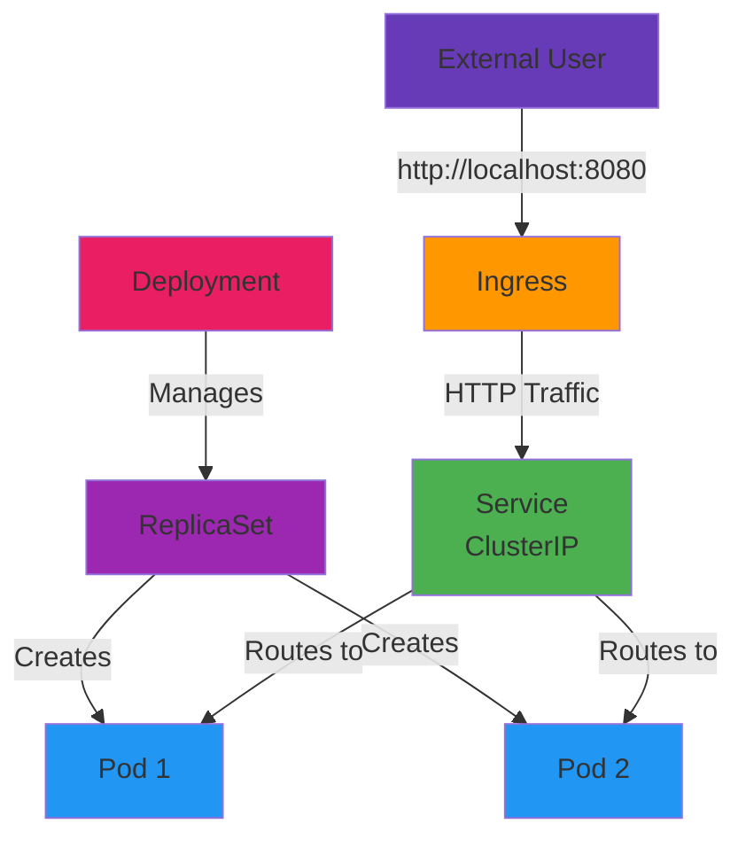

# Day 04 - Kubernetes Core Refresher

> **Goal**: Deploy app using Pod → Deployment → Service → Ingress pattern  
> **Time**: 20 min | **Prereq**: [Day 03]

---

## The Concept (ONE Diagram)



**Read the diagram:**
- **Deployment**: Declares desired state (2 replicas of nginx)
- **ReplicaSet**: Auto-created, ensures 2 pods always running
- **Pods**: Actual containers (nginx) doing the work
- **Service**: Stable internal IP for pods (even when pods restart)
- **Ingress**: HTTP routing from external → service

---

## Kubernetes Primitives

| Resource | Purpose | Lifespan |
|----------|---------|----------|
| **Pod** | Smallest unit (1+ containers) | Ephemeral (dies when container crashes) |
| **ReplicaSet** | Ensures N pods running | Auto-created by Deployment |
| **Deployment** | Declares desired state, handles rollouts | Persistent |
| **Service** | Stable IP/DNS for pods | Persistent |
| **Ingress** | HTTP(S) routing from outside | Persistent |

---

## Step 1: Create Deployment + Service

```bash
# Create working directory
mkdir -p artifacts/section-01/k8s-basics
cd artifacts/section-01/k8s-basics

# Create Deployment + Service in one file
cat > frontend-app.yaml << 'EOF'
apiVersion: apps/v1
kind: Deployment
metadata:
  name: frontend
  labels:
    app: frontend
spec:
  replicas: 2
  selector:
    matchLabels:
      app: frontend
  template:
    metadata:
      labels:
        app: frontend
    spec:
      containers:
      - name: nginx
        image: nginx:1.25-alpine
        ports:
        - containerPort: 80
---
apiVersion: v1
kind: Service
metadata:
  name: frontend-svc
spec:
  selector:
    app: frontend
  ports:
  - protocol: TCP
    port: 80
    targetPort: 80
  type: ClusterIP
EOF

# Apply to cluster
kubectl apply -f frontend-app.yaml
```

**What just happened:**
- Created Deployment → ReplicaSet → 2 Pods (nginx)
- Created Service with stable ClusterIP
- Service routes traffic to pods with label `app: frontend`

---

## Step 2: Verify Deployment

```bash
# Check deployment
kubectl get deployments
# NAME       READY   UP-TO-DATE   AVAILABLE   AGE
# frontend   2/2     2            2           30s

# Check pods
kubectl get pods -l app=frontend
# NAME                        READY   STATUS    RESTARTS   AGE
# frontend-6d5f8b9c4d-abc12   1/1     Running   0          30s
# frontend-6d5f8b9c4d-xyz34   1/1     Running   0          30s

# Check service
kubectl get svc frontend-svc
# NAME           TYPE        CLUSTER-IP      EXTERNAL-IP   PORT(S)
# frontend-svc   ClusterIP   10.96.123.45    <none>        80/TCP

# Describe service (see endpoints)
kubectl describe svc frontend-svc
# Endpoints: 10.244.1.2:80,10.244.1.3:80  (2 pod IPs)
```

---

## Step 3: Create Ingress

```bash
# Create Ingress for external access
cat > frontend-ingress.yaml << 'EOF'
apiVersion: networking.k8s.io/v1
kind: Ingress
metadata:
  name: frontend-ingress
  annotations:
    nginx.ingress.kubernetes.io/rewrite-target: /
spec:
  ingressClassName: nginx
  rules:
  - http:
      paths:
      - path: /
        pathType: Prefix
        backend:
          service:
            name: frontend-svc
            port:
              number: 80
EOF

# Apply Ingress
kubectl apply -f frontend-ingress.yaml

# Verify Ingress
kubectl get ingress frontend-ingress
```

---

## Step 4: Test Access

```bash
# Port-forward ingress controller (in separate terminal)
kubectl port-forward -n ingress-nginx svc/ingress-nginx-controller 8080:80

# Test with curl (in main terminal)
curl http://localhost:8080/

# Expected output: nginx HTML (Welcome to nginx!)
```

**Or open browser:** http://localhost:8080

---

## The 4-Layer Pattern

```
Layer 4: Ingress (HTTP routing)
    ↓
Layer 3: Service (stable IP/DNS)
    ↓
Layer 2: ReplicaSet (ensure N pods)
    ↓
Layer 1: Pod (container runtime)
```

**Why 4 layers?**
- **Pod**: Ephemeral (dies, gets new IP)
- **ReplicaSet**: Auto-healing (recreates dead pods)
- **Service**: Stable endpoint (DNS name never changes)
- **Ingress**: External access (HTTP routing rules)

---

## Key Concepts

### Desired vs Actual State

**You declare desired state:**
```yaml
spec:
  replicas: 2  # I want 2 pods
```

**Kubernetes reconciles actual state:**
- 0 pods running → creates 2
- 1 pod running → creates 1 more
- 3 pods running → deletes 1
- Pod crashes → creates replacement

### Labels & Selectors

```yaml
# Deployment says: manage pods with app=frontend
selector:
  matchLabels:
    app: frontend

# Service says: route to pods with app=frontend
selector:
  app: frontend
```

**Labels connect everything!**

---

## Common Issues

| Error | Fix |
|-------|-----|
| `ImagePullBackOff` | Check internet, image name correct |
| `CrashLoopBackOff` | Check logs: `kubectl logs <pod-name>` |
| `0/2 pods ready` | Wait 30s, then `kubectl describe deployment frontend` |
| `Service has no endpoints` | Check pod labels match service selector |
| `Ingress not working` | Verify ingress-nginx installed: `kubectl get pods -n ingress-nginx` |
| `port-forward fails` | Check service exists: `kubectl get svc frontend-svc` |

---

## Test Self-Healing

```bash
# Delete one pod (watch it recreate)
POD_NAME=$(kubectl get pods -l app=frontend -o jsonpath='{.items[0].metadata.name}')
kubectl delete pod $POD_NAME

# Watch ReplicaSet recreate it
kubectl get pods -l app=frontend -w
# (Ctrl+C to stop watching)

# Still 2 pods running!
kubectl get pods -l app=frontend
```

---

## Scaling

```bash
# Scale up to 5 replicas
kubectl scale deployment frontend --replicas=5

# Verify
kubectl get pods -l app=frontend
# (Now 5 pods)

# Service automatically routes to all 5
kubectl describe svc frontend-svc
# Endpoints: (5 pod IPs listed)

# Scale back down
kubectl scale deployment frontend --replicas=2
```

---

## Clean Up

```bash
# Delete all resources
kubectl delete -f frontend-app.yaml
kubectl delete -f frontend-ingress.yaml

# Verify deletion
kubectl get all -l app=frontend
# No resources found
```

---

## Operational Insights

### Why Platform Teams Must Know This
- **Debugging at 3am**: "Why is my pod crashing?"
- **Template design**: Backstage templates generate these manifests
- **Performance tuning**: Resource requests/limits (Day 05)
- **Security**: RBAC controls who can create/delete (Day 06)

### Production Checklist
- [ ] Resource limits set (CPU/memory)
- [ ] Liveness/readiness probes configured
- [ ] Pod disruption budgets defined
- [ ] HPA (Horizontal Pod Autoscaler) enabled
- [ ] Service mesh (Istio) configured
- [ ] Observability (logs, metrics, traces)

---

## Next Day

→ **Day 05**: [Config & Secret Management](day-05-config-secret-management.md) - Externalize configuration

---

## Want More?

📚 **Deep Dive**: See [Day 04 - Original](../../modules/Section-01-kubernetes-primitives/day-04-kubernetes-core-refresher/)  
📖 **Resources**:
- [Kubernetes Concepts](https://kubernetes.io/docs/concepts/)
- [Deployments Guide](https://kubernetes.io/docs/concepts/workloads/controllers/deployment/)
- [Services Guide](https://kubernetes.io/docs/concepts/services-networking/service/)
- [Ingress Guide](https://kubernetes.io/docs/concepts/services-networking/ingress/)

---

## Deliverables Checklist

- [ ] `artifacts/section-01/k8s-basics/` folder created
- [ ] `frontend-app.yaml` created (Deployment + Service)
- [ ] `frontend-ingress.yaml` created
- [ ] Deployment running (2 pods)
- [ ] Service has endpoints
- [ ] Ingress accessible via http://localhost:8080
- [ ] Self-healing tested (pod deletion)
- [ ] Files committed to Git
