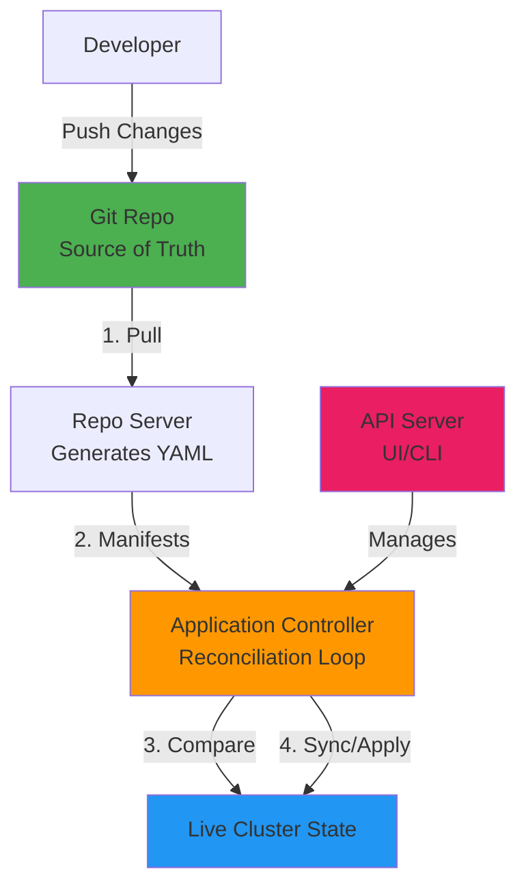
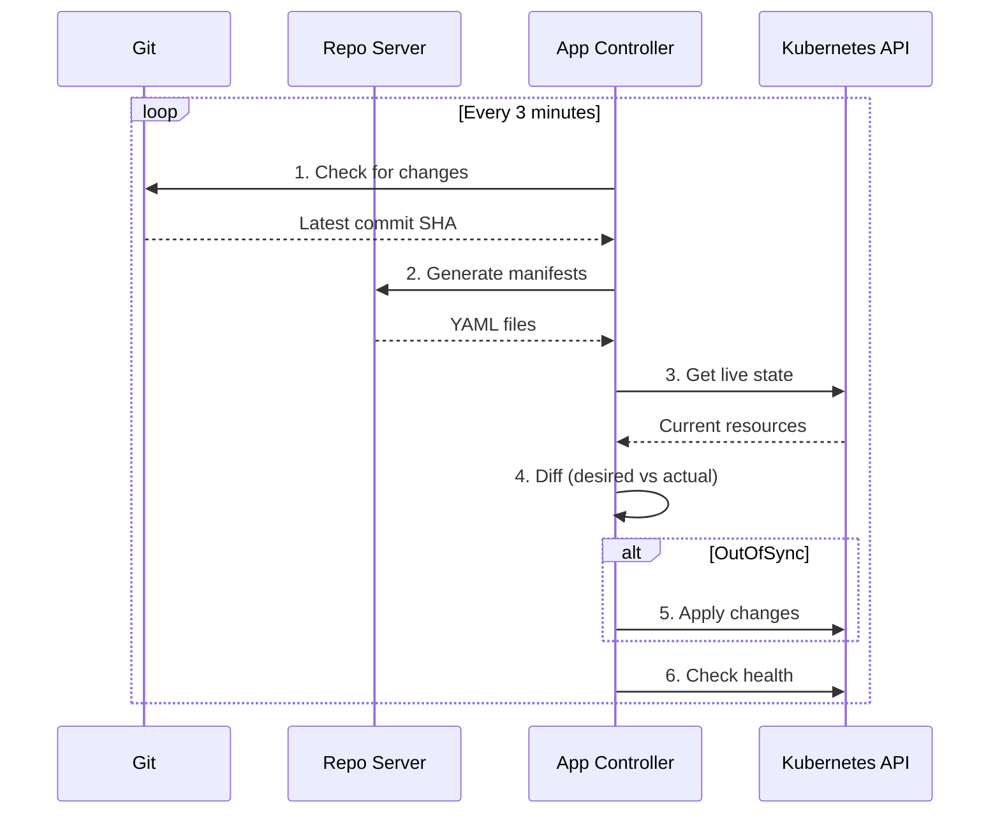

# Day 09 - GitOps & ArgoCD Architecture

> **Goal**: Understand GitOps principles and ArgoCD component architecture  
> **Time**: 10 min | **Prereq**: Kubernetes basics

---

## The Concept (ONE Diagram)



**Read the diagram:**
- **Git Repo**: Single source of truth (desired state)
- **Repo Server**: Clones Git, runs Helm/Kustomize, caches generated YAML
- **Application Controller**: Brain of ArgoCD - compares desired vs actual, fixes drift
- **API Server**: User-facing (UI, CLI, API) - manages Applications
- **Pull Model**: ArgoCD pulls from Git (secure - no cluster credentials in CI)

---

## GitOps vs Traditional CI/CD

| Model | Who Deploys | Credentials | Audit Trail | Drift Detection |
|-------|-------------|-------------|-------------|-----------------|
| **Push (Traditional)** | CI/CD pushes to cluster | CI has cluster admin | Only in CI logs | Manual |
| **Pull (GitOps)** | ArgoCD pulls from Git | Only ArgoCD has access | Git commit history | Automatic |

**Why GitOps wins:**
- Git is the audit trail (who changed what, when, why)
- No cluster credentials in CI/CD pipelines
- Automatic drift correction (self-healing)
- Easy rollback (git revert)

---

## GitOps Principles (OpenGitOps)

1. **Declarative**: Desired state in YAML (not imperative scripts)
2. **Versioned**: Git provides immutable history
3. **Pulled Automatically**: ArgoCD polls Git, no webhooks needed
4. **Continuously Reconciled**: ArgoCD fixes drift every 3 minutes

---

## ArgoCD Components (3 Core Services)

### 1. API Server
- **Purpose**: User interface (Web UI, CLI, REST API)
- **Functions**: 
  - RBAC enforcement
  - Application/repository/cluster management
  - Webhook receiver (optional)
- **Talks to**: Application Controller, Redis

### 2. Repository Server
- **Purpose**: Git operations & manifest generation
- **Functions**:
  - Clones Git repos (caches in Redis)
  - Generates manifests (Helm, Kustomize, plain YAML)
  - Credential management for Git repos
- **Talks to**: Git servers, Redis

### 3. Application Controller
- **Purpose**: Reconciliation loop (Kubernetes Operator)
- **Functions**:
  - Watches Applications (CRD)
  - Compares desired state (from Repo Server) vs live state (from K8s API)
  - Syncs when OutOfSync
  - Health checks
  - Self-healing
- **Talks to**: Repo Server, Kubernetes API

---

## Supporting Components

| Component | Purpose |
|-----------|---------|
| **Redis** | Cache for Git repo data & app state |
| **Dex** | SSO/OIDC authentication (optional) |
| **Notifications Controller** | Slack/email alerts (optional) |
| **ApplicationSet Controller** | Multi-app generator (optional) |

---

## The Reconciliation Loop



**Key Points:**
- Runs continuously (default: every 3 minutes)
- Compares commit SHA, not full YAML diff initially
- Only generates manifests if Git changed
- Only applies if OutOfSync
- Health checks run after every sync

---

## Desired State vs Live State

**Desired State (Git):**
```yaml
apiVersion: apps/v1
kind: Deployment
metadata:
  name: frontend
spec:
  replicas: 3  # We want 3
```

**Live State (Cluster):**
```
$ kubectl get deployment frontend
NAME       READY   UP-TO-DATE   AVAILABLE
frontend   2/3     2            2
```

**ArgoCD Status:** `OutOfSync` (desired: 3, actual: 2)  
**Action (if auto-sync):** Apply → creates 3rd pod

---

## Application CRD (The Core Resource)

```yaml
apiVersion: argoproj.io/v1alpha1
kind: Application
metadata:
  name: my-app
  namespace: argocd
spec:
  project: default
  source:
    repoURL: https://github.com/example/repo
    targetRevision: HEAD
    path: manifests
  destination:
    server: https://kubernetes.default.svc
    namespace: default
  syncPolicy:
    automated:
      prune: true
      selfHeal: true
```

**This tells ArgoCD:**
- Watch `github.com/example/repo/manifests`
- Deploy to `default` namespace
- Auto-sync on Git changes
- Delete resources removed from Git (prune)
- Fix manual changes (selfHeal)

---

## Operational Insight

**GitOps means revoking human access:**
- Developer runs: `kubectl scale deployment frontend --replicas=5`
- ArgoCD detects drift (Git says 3, cluster has 5)
- ArgoCD reverts to 3 replicas within 3 minutes
- **Correct way:** Change Git → Push → ArgoCD syncs

**Benefits:**
- All changes have Git history (audit trail)
- No "snowflake" environments (drift-free)
- Easy rollback (`git revert`)
- Disaster recovery (redeploy from Git)

---

## Common Questions

**Q: What if Git is down?**  
A: ArgoCD keeps running (uses cached state). Cluster keeps working. New syncs wait until Git is back.

**Q: Can I still use kubectl?**  
A: Yes, for debugging (view logs, describe pods). But don't edit resources - ArgoCD will revert.

**Q: How fast is sync?**  
A: Default poll: 3 minutes. Can enable webhooks for instant sync.

**Q: What about secrets?**  
A: Don't store plain secrets in Git! Use Sealed Secrets, External Secrets Operator, or HashiCorp Vault.

---

## Next Day

→ **Day 10**: [ArgoCD Install & Access](day-10-argocd-install-access.md) - Install ArgoCD, access UI

---

## Want More?

📚 **Deep Dive**: See [Day 09 - Original](../../modules/Section-02-argocd-foundations/day-09-gitops-argocd-architecture/)  
⏭️ **Advanced Topics**:
- High Availability setup
- Sharding for 1000+ apps
- Multi-tenancy patterns
- Disaster recovery

---

## Key Takeaways

- GitOps = Git as single source of truth + automated reconciliation
- ArgoCD = 3 core services (API, Repo, Controller) + supporting components
- Pull model > Push model (security, audit, drift detection)
- Application CRD defines what to sync from where to where
- Reconciliation loop runs every 3 minutes (configurable)
