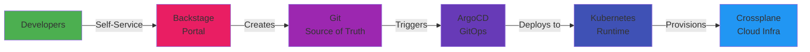

# Day 00 - Platform Vision & Kickoff

> **Goal**: Define your Internal Developer Platform (IDP) mission and success metrics  
> **Time**: 15 min | **Prereq**: None - Start here!

---

## The Concept (ONE Diagram)



**Read the diagram:**
- **Backstage**: Developer portal (self-service templates)
- **Git**: Single source of truth (all config versioned)
- **ArgoCD**: GitOps engine (auto-deploys from Git)
- **Kubernetes**: Container orchestration (runs apps)
- **Crossplane**: Infrastructure as Code (provisions cloud resources)

---

## Key Definitions

### Internal Developer Platform (IDP)
Self-service product that provides:
- Paved roads (golden paths)
- Guardrails (security, compliance)
- Abstraction (hide complexity)

### Platform Engineering vs DevOps
| | DevOps | Platform Engineering |
|-|--------|---------------------|
| **What** | Culture + practices | Centralized product |
| **Who builds** | Everyone | Platform team |
| **Who uses** | Same teams | App developers |

### Golden Path
Standardized, recommended workflow covering:
- Service scaffolding
- Deployment
- Observability
- Security

**Goal:** 15 minutes from idea to production (not 14 days)

---

## The Problem We're Solving

**Before Platform:**
- New service setup: **14 days** (5 tickets, 3 teams involved)
- Deployment process: Manual, inconsistent, fragile
- Developer experience: "How do I deploy this?"
- Security: Reactive (quarterly audits)

**After Platform:**
- New service setup: **15 minutes** (self-service template)
- Deployment process: Git push → auto-deploy
- Developer experience: "Just click Create Service"
- Security: Proactive (policy as code)

---

## Your Platform Mission (Template)

```bash
# Create your vision document
mkdir -p artifacts/section-00

cat > artifacts/section-00/idp-vision.md << 'EOF'
# IDP Vision

## Problem Statement
Engineering velocity is stalling. It takes 14 days and 5 tickets to provision 
a standard microservice with a database. Developers copy/paste outdated CI/CD 
pipelines, leading to inconsistent security.

## Target Outcomes
- Reduce service scaffolding: 14 days → 15 minutes
- Standardize 100% of new deployments on Golden Path
- Built-in DevSecOps scanning

## Platform Users
- 250 Backend Engineers (Java/Node)
- 50 Frontend Engineers (React)
- 20 QA Automation Engineers

## Non-Goals
- Won't support legacy on-premise VMs
- Won't support manual Jenkins pipeline edits

## Success Metrics (DORA)
- Deployment Frequency: +40%
- Lead Time for Changes: 14 days → <1 day
- Change Failure Rate: <15%
- MTTR: <1 hour
- Developer NPS: 90+

## 90-Day Plan
Launch MVP Backstage portal to "Lighthouse" Payments Team.
Support 2 templates: Node.js/Postgres, Java/Spring.
Deprecate manual ticketing for these stacks.
EOF
```

---

## Current State Assessment

```bash
cat > artifacts/section-00/current-state.md << 'EOF'
# Current State Assessment

## Delivery
- Release frequency: Bi-weekly coordinated trains (manual)
- PR-to-prod time: 7-10 business days

## Reliability
- Major incidents: 3 per quarter (misconfig)
- MTTR: 4 hours (reverting AWS console changes)

## Developer Experience
- Service bootstrap: 14 days (tickets + approvals)
- Environment setup: 3 days (secrets, VPNs)

## Governance
- Access: Fragmented (devs have permanent admin in non-prod)
- Policy: Reactive (quarterly security audits)
EOF
```

---

## Platform Capability Map

```
┌─────────────────────────────────────────────┐
│ Backstage Portal (Developer Experience)    │
└──────────────┬──────────────────────────────┘
               │
               ▼
┌─────────────────────────────────────────────┐
│ Git Repository (Single Source of Truth)    │
└──────────────┬──────────────────────────────┘
               │
               ▼
┌─────────────────────────────────────────────┐
│ ArgoCD (GitOps Application Delivery)       │
└──────────────┬──────────────────────────────┘
               │
               ▼
┌─────────────────────────────────────────────┐
│ Kubernetes (Container Runtime)             │
└──────────────┬──────────────────────────────┘
               │
               ▼
┌─────────────────────────────────────────────┐
│ Crossplane (Infrastructure Provisioning)   │
└──────────────┬──────────────────────────────┘
               │
               ▼
┌─────────────────────────────────────────────┐
│ Cloud Provider (AWS/GCP/Azure)             │
└─────────────────────────────────────────────┘
```

**5 Core Capabilities:**
1. **Service Scaffolding** (Backstage templates)
2. **GitOps Delivery** (ArgoCD)
3. **Self-Service Infrastructure** (Crossplane)
4. **Runtime Standards** (K8s policies + observability)
5. **Day-2 Operations** (alerts, runbooks, SLOs)

---

## What You'll Build (61 Days)

| Weeks 1-2 | Weeks 3-4 | Weeks 5-6 | Weeks 7-8 | Weeks 9-10 |
|-----------|-----------|-----------|-----------|------------|
| K8s + ArgoCD | Crossplane | Backstage | Golden Paths | Production |

**End Result:**
- Self-service developer portal
- Git-driven deployments
- Cloud infra on-demand
- Production-grade observability
- Full platform portfolio

---

## Operational Insights

### Treat Platform as a Product
- **Customers**: App developers
- **SLAs**: 99.9% uptime, <5 min response
- **Metrics**: Adoption rate, NPS, template usage
- **Versioning**: v1 templates, v2 templates (deprecation)

### Start Small, Scale Fast
- Pick 1 "lighthouse" team (not the whole org)
- Support 2 templates (not 20)
- Ship MVP in 90 days (not 2 years)

### Measure Everything
- Before metrics (baseline)
- During metrics (adoption)
- After metrics (outcomes)

---

## Common Anti-Patterns

❌ **Building without customers** - "If we build it, they will come"  
✅ Work with 1 team, understand their pain

❌ **Boiling the ocean** - Supporting every tech stack day 1  
✅ Start with 2 golden paths, expand later

❌ **Feature factory** - Adding features without measuring adoption  
✅ Track usage, iterate on what's used

❌ **No product thinking** - Treating platform as infrastructure  
✅ Roadmap, backlog, user interviews, NPS

---

## Next Day

→ **Day 01**: [Environment Bootstrap](day-01-environment-bootstrap.md) - Setup local dev cluster

---

## Want More?

📚 **Deep Dive**: See [Day 00 - Original](../../modules/Section-00-orientation/day-00-kickoff/)  
📖 **Resources**:
- [CNCF Platform Engineering Whitepaper](https://tag-app-delivery.cncf.io/whitepapers/platform-engineering-whitepaper/)
- [DORA Metrics Guide](https://cloud.google.com/devops)
- [Backstage Docs](https://backstage.io/docs/)

---

## Deliverables Checklist

- [ ] Created `artifacts/section-00/idp-vision.md`
- [ ] Defined problem statement
- [ ] Listed target outcomes
- [ ] Identified platform users
- [ ] Set success metrics (DORA)
- [ ] Drafted 90-day plan
