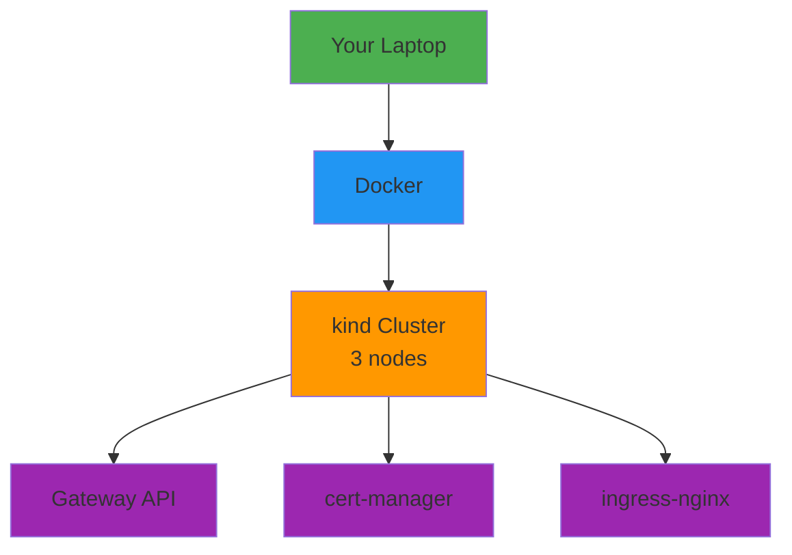

# Day 01 - Environment Bootstrap

> **Goal**: Setup local Kubernetes cluster with essential tooling  
> **Time**: 20 min | **Prereq**: [Day 00](day-00-kickoff.md)

---

## The Concept (ONE Diagram)



**Read the diagram:**
- **Docker**: Container runtime (runs kind)
- **kind**: Kubernetes in Docker (3-node cluster)
- **Gateway API**: Modern ingress (for Backstage/ArgoCD)
- **cert-manager**: TLS certificate automation
- **ingress-nginx**: HTTP routing (Section 01 labs)

---

## Minimum Toolchain

| Tool | Version | Purpose |
|------|---------|---------|
| **Docker** | v24+ | Container runtime |
| **kubectl** | v1.28+ | K8s CLI |
| **kind** | v0.20+ | Local K8s cluster |
| **Helm** | v3.14+ | K8s package manager |
| **Node.js** | v18/v20 LTS | Backstage requirement |
| **Git** | Any | Version control |

---

## Step 1: Verify Toolchain

```bash
# Create validation script
cat > validate-setup.sh << 'EOF'
#!/bin/bash
echo "=== Toolchain Validation ==="

# Docker
docker version --format 'Docker: {{.Server.Version}}' 2>/dev/null || echo "❌ Docker not running!"

# kubectl
kubectl version --client --short 2>/dev/null || echo "❌ kubectl missing!"

# kind
kind version 2>/dev/null || echo "❌ kind missing!"

# Helm
helm version --template 'Helm: {{.Version}}' 2>/dev/null || echo "❌ helm missing!"

# Node.js
echo "Node.js: $(node --version 2>/dev/null || echo 'missing')"
echo "npm: $(npm --version 2>/dev/null || echo 'missing')"

# Git
git --version 2>/dev/null || echo "❌ git missing!"

echo -e "\n✅ All tools present? Run next steps."
EOF

chmod +x validate-setup.sh
./validate-setup.sh
```

**Expected output:**
```
Docker: 24.0.7
kubectl: v1.28.0
kind: v0.20.0
Helm: v3.14.0
Node.js: v20.10.0
npm: 10.2.3
git version 2.42.0
```

**If missing tools:** See [installation guide](#install-missing-tools) below.

---

## Step 2: Create kind Cluster

```bash
# Create 3-node cluster config
cat > kind-config.yaml << 'EOF'
kind: Cluster
apiVersion: kind.x-k8s.io/v1alpha4
name: platform-engineering
nodes:
  - role: control-plane
  - role: worker
  - role: worker
EOF

# Create cluster (~2 min)
kind create cluster --config kind-config.yaml

# Verify cluster
kubectl cluster-info --context kind-platform-engineering
kubectl get nodes
```

**Expected output:**
```
NAME                                STATUS   ROLES           AGE
platform-engineering-control-plane   Ready    control-plane   1m
platform-engineering-worker          Ready    <none>          1m
platform-engineering-worker2         Ready    <none>          1m
```

---

## Step 3: Install Gateway API

```bash
# Install Gateway API CRDs (v1.0.0)
kubectl apply -f https://github.com/kubernetes-sigs/gateway-api/releases/download/v1.0.0/experimental-install.yaml

# Verify CRDs installed
kubectl get crd | grep gateway
```

**Expected:** `gatewayclasses.gateway.networking.k8s.io`, `gateways.gateway.networking.k8s.io`

---

## Step 4: Install Envoy Gateway

```bash
# Install Envoy Gateway (v1.0.2)
helm install eg oci://docker.io/envoyproxy/gateway-helm \
  --namespace envoy-gateway-system \
  --create-namespace \
  --version v1.0.2

# Wait for ready (~1 min)
kubectl wait \
  --namespace envoy-gateway-system \
  --for=condition=ready pod \
  --selector=control-plane=envoy-gateway \
  --timeout=180s

# Verify
kubectl get pods -n envoy-gateway-system
```

**Expected:** `envoy-gateway-xxx` pod Running

---

## Step 5: Install cert-manager

```bash
# Add Helm repo
helm repo add jetstack https://charts.jetstack.io
helm repo update

# Install cert-manager (v1.14.4)
helm install cert-manager jetstack/cert-manager \
  --namespace cert-manager \
  --create-namespace \
  --version v1.14.4 \
  --set crds.enabled=true \
  --set startupapicheck.enabled=false

# Verify (~30 sec)
kubectl get pods -n cert-manager
```

**Expected:** 3 pods (cert-manager, cainjector, webhook) Running

---

## Step 6: Install ingress-nginx

```bash
# Add Helm repo
helm repo add ingress-nginx https://kubernetes.github.io/ingress-nginx
helm repo update

# Install ingress-nginx
helm install ingress-nginx ingress-nginx/ingress-nginx \
  --namespace ingress-nginx \
  --create-namespace \
  --set controller.service.type=ClusterIP

# Wait for ready (~1 min)
kubectl wait \
  --namespace ingress-nginx \
  --for=condition=ready pod \
  --selector=app.kubernetes.io/component=controller \
  --timeout=180s

# Verify
kubectl get pods -n ingress-nginx
```

**Expected:** `ingress-nginx-controller-xxx` pod Running

---

## Step 7: Create Project Structure

```bash
# Create workspace folders
mkdir -p platform/{apps,infra,docs,scripts}
mkdir -p artifacts/section-00

# Verify structure
tree platform/ artifacts/
```

**Structure:**
```
platform/
├── apps/       # Application manifests
├── infra/      # Infrastructure as code
├── docs/       # Documentation
└── scripts/    # Automation scripts

artifacts/
└── section-00/ # Course deliverables
```

---

## Verification Checklist

```bash
# Run full verification
cat > verify-bootstrap.sh << 'EOF'
#!/bin/bash
echo "=== Bootstrap Verification ==="

# Cluster
echo -n "Cluster: "
kubectl get nodes --no-headers | wc -l | grep -q 3 && echo "✅ 3 nodes" || echo "❌ nodes missing"

# Gateway API
echo -n "Gateway API: "
kubectl get crd gatewayclasses.gateway.networking.k8s.io &>/dev/null && echo "✅ installed" || echo "❌ missing"

# Envoy Gateway
echo -n "Envoy Gateway: "
kubectl get pods -n envoy-gateway-system --no-headers 2>/dev/null | grep -q Running && echo "✅ running" || echo "❌ not running"

# cert-manager
echo -n "cert-manager: "
kubectl get pods -n cert-manager --no-headers 2>/dev/null | grep -c Running | grep -q 3 && echo "✅ 3 pods" || echo "❌ not running"

# ingress-nginx
echo -n "ingress-nginx: "
kubectl get pods -n ingress-nginx --no-headers 2>/dev/null | grep -q Running && echo "✅ running" || echo "❌ not running"

echo -e "\n✅ Ready for Day 02!"
EOF

chmod +x verify-bootstrap.sh
./verify-bootstrap.sh
```

---

## Common Issues

| Error | Fix |
|-------|-----|
| `Docker daemon not running` | Start Docker Desktop |
| `kind cluster exists` | Delete: `kind delete cluster --name platform-engineering` |
| `connection refused` | Wait 30s for pods to start |
| `ImagePullBackOff` | Check internet connection, Docker proxy settings |
| `context kind-xxx not found` | Run: `kubectl config use-context kind-platform-engineering` |

---

## Install Missing Tools

### Docker
- **Mac**: [Docker Desktop](https://docs.docker.com/desktop/install/mac-install/)
- **Windows**: [Docker Desktop](https://docs.docker.com/desktop/install/windows-install/) (enable WSL2)
- **Linux**: [Docker Engine](https://docs.docker.com/engine/install/)

### kubectl
```bash
# Mac
brew install kubectl

# Linux
curl -LO "https://dl.k8s.io/release/$(curl -L -s https://dl.k8s.io/release/stable.txt)/bin/linux/amd64/kubectl"
chmod +x kubectl && sudo mv kubectl /usr/local/bin/

# Windows (PowerShell)
choco install kubernetes-cli
```

### kind
```bash
# Mac
brew install kind

# Linux
curl -Lo ./kind https://kind.sigs.k8s.io/dl/latest/kind-linux-amd64
chmod +x ./kind && sudo mv ./kind /usr/local/bin/kind

# Windows
choco install kind
```

### Helm
```bash
# Mac
brew install helm

# Linux
curl https://raw.githubusercontent.com/helm/helm/main/scripts/get-helm-3 | bash

# Windows
choco install kubernetes-helm
```

### Node.js
- Download LTS: https://nodejs.org/en/download

---

## Clean Up (Optional)

```bash
# Delete cluster (keeps tools installed)
kind delete cluster --name platform-engineering

# Recreate from kind-config.yaml when needed
kind create cluster --config kind-config.yaml
```

---

## Next Day

→ **Day 02**: [Cloud Cost Guardrails](day-02-cloud-cost-guardrails.md) - Resource quotas & limits

---

## Want More?

📚 **Deep Dive**: See [Day 01 - Original](../../modules/Section-00-orientation/day-01-environment-bootstrap/)  
📖 **Resources**:
- [kind Best Practices](https://kind.sigs.k8s.io/docs/user/quick-start/)
- [Gateway API Concepts](https://gateway-api.sigs.k8s.io/concepts/api-overview/)
- [cert-manager Tutorial](https://cert-manager.io/docs/tutorials/)

---

## Deliverables Checklist

- [ ] All tools installed & validated
- [ ] 3-node kind cluster running
- [ ] Gateway API CRDs installed
- [ ] Envoy Gateway running
- [ ] cert-manager running (3 pods)
- [ ] ingress-nginx running
- [ ] Project folders created
- [ ] Verification script passes
