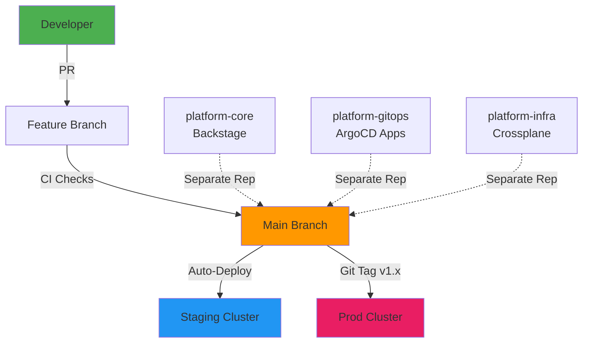
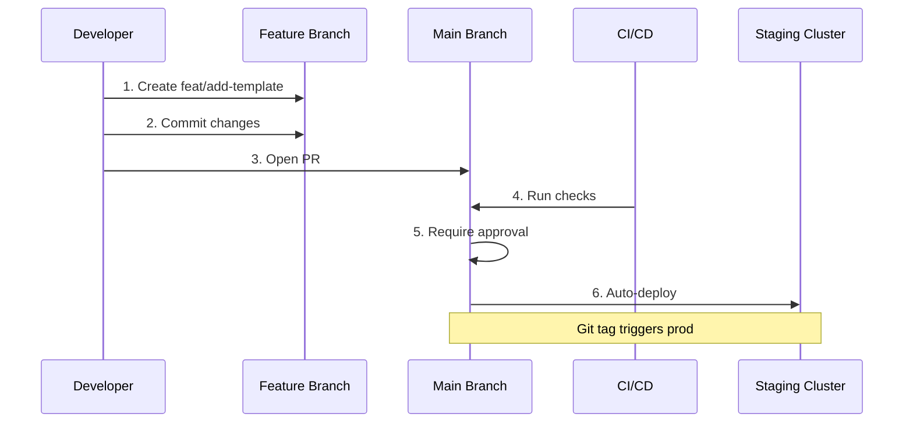

# Day 03 - Repo & Branching Strategy

> **Goal**: Design GitOps repository structure and branching workflow  
> **Time**: 15 min | **Prereq**: [Day 02](day-02-cloud-cost-guardrails.md)

---

## The Concept (ONE Diagram)



**Read the diagram:**
- **Multi-repo**: Separate repos for platform-core, gitops, infra
- **Trunk-based**: Short-lived feature branches → main
- **Auto-deploy**: main → staging automatically
- **Manual promote**: Git tag → production

---

## Mono-repo vs Multi-repo

| | Mono-repo | Multi-repo (Recommended) |
|-|-----------|--------------------------|
| **Pros** | Unified PRs, atomic changes | Isolated blast radius, clear ownership |
| **Cons** | Large codebase, slow CI | Cross-repo coordination |
| **Best for** | Small teams (<10) | Large teams, separate domains |

**We use multi-repo:**
- Platform team owns `platform-*` repos
- App teams own `app-*` repos
- Clear CODEOWNERS per repo

---

## Repository Topology

```
platform-core/           # Backstage portal
├── packages/
│   └── backend/
│   └── app/
├── templates/           # Software templates
└── plugins/             # Custom plugins

platform-gitops/         # ArgoCD source of truth
├── apps/
│   ├── dev/
│   ├── staging/
│   └── prod/
└── infrastructure/      # Bootstrap apps

platform-infra/          # Crossplane compositions
├── apis/
│   └── database/
│   └── storage/
└── providers/

app-frontend/            # Team-owned app (generated from template)
├── src/
├── k8s/
└── .backstage.yaml
```

---

## Step 1: Initialize GitOps Repo

```bash
# Create platform GitOps repository
mkdir -p platform-gitops-repo
cd platform-gitops-repo

git init
git checkout -b main

# Create .gitignore (NEVER commit secrets!)
cat > .gitignore << 'EOF'
# Kubernetes/IDE
.idea/
.vscode/
*.swp
.DS_Store

# Secrets (CRITICAL!)
*.pem
*.key
.env
secrets.yaml
*-secret.yaml
EOF

# Create folder structure
mkdir -p apps/{dev,staging,prod}
mkdir -p infrastructure/{argocd,crossplane,backstage}

# Initial commit
git add .
git commit -m "chore: initialize platform gitops repository"
```

---

## Step 2: Setup CODEOWNERS

```bash
# Create CODEOWNERS for PR routing
mkdir -p .github
cat > .github/CODEOWNERS << 'EOF'
# Platform team owns core infra
/infrastructure/ @platform-engineering-team

# Infra team owns database compositions  
/infrastructure/crossplane/ @infrastructure-team

# App teams own their namespaces
/apps/team-alpha/ @team-alpha
/apps/team-beta/ @team-beta
EOF

git add .github/CODEOWNERS
git commit -m "chore: add CODEOWNERS for PR routing"
```

**What CODEOWNERS does:**
- Auto-assigns reviewers based on file path
- Enforces mandatory reviews from correct team
- Prevents unauthorized changes to critical paths

---

## Step 3: Branching Strategy (Trunk-Based)



**Rules:**
- Feature branches: Short-lived (<48 hours)
- Naming: `feat/`, `fix/`, `chore/`, `docs/`
- PR required (no direct push to main)
- CI must pass before merge
- 1+ approval from CODEOWNERS

---

## Step 4: Commit Conventions (Conventional Commits)

```bash
# Good commits:
feat(argocd): add applicationset for multi-env
fix(backstage): correct template parameter validation
docs(readme): update branching strategy
chore(deps): upgrade crossplane to v1.14

# Bad commits:
"updated stuff"
"fix bug"
"wip"
```

**Format:** `<type>(<scope>): <description>`

**Types:**
- `feat`: New feature
- `fix`: Bug fix
- `docs`: Documentation only
- `chore`: Maintenance (deps, config)
- `refactor`: Code restructure (no behavior change)
- `test`: Add/update tests

---

## Step 5: GitHub Protection Rules

```bash
# Document protection rules for GitHub
cat > artifacts/section-00/github-protection.md << 'EOF'
# GitHub Branch Protection (main branch)

## Required Checks
- [ ] Require pull request reviews (minimum 1)
- [ ] Require status checks to pass:
  - [ ] CI/CD pipeline
  - [ ] SonarQube (>80% coverage)
  - [ ] Trivy security scan
  - [ ] Conventional commit check
- [ ] Require branches to be up to date before merging
- [ ] Require linear history (no merge commits)
- [ ] Block force pushes
- [ ] Block deletions

## CODEOWNERS Enforcement
- [ ] Require review from code owners
- [ ] Dismiss stale reviews on new commits

## Status Checks (CI)
- Lint: ESLint, Prettier
- Test: Jest, Pytest
- Security: Trivy, Checkov
- Coverage: SonarQube >80%
EOF
```

---

## Step 6: Repository Strategy Document

```bash
mkdir -p artifacts/section-00
cat > artifacts/section-00/repo-strategy.md << 'EOF'
# Repository & Branching Strategy

## Repo Topology (Multi-repo)
1. **platform-core** (Backstage portal)
   - Owner: Platform Engineering team
   - Contains: Templates, plugins, portal config

2. **platform-gitops** (ArgoCD source of truth)
   - Owner: Platform Engineering team
   - Contains: Application manifests, ArgoCD apps

3. **platform-infra** (Crossplane compositions)
   - Owner: Infrastructure team
   - Contains: XRDs, compositions, providers

4. **app-*** (Team-owned services)
   - Owner: Application teams
   - Generated via Backstage templates

## Branching Model (Trunk-Based Development)
- **Main branch**: Always deployable
- **Feature branches**: Short-lived (<48 hours)
- **Naming**: feat/*, fix/*, chore/*, docs/*
- **No direct pushes**: PRs required for all changes

## PR Governance
- **Mandatory reviews**: 1+ from CODEOWNERS
- **CI must pass**: Lint, test, security scan
- **Conventional commits**: Enforced via pre-commit hook
- **Linear history**: No merge commits (rebase or squash)

## Environment Promotion
- **Dev**: Auto-deploy on every commit to main
- **Staging**: Auto-deploy on merge to main
- **Prod**: Manual promotion via Git tag (v1.2.0)

## Security
- **Never commit secrets**: Use Sealed Secrets or External Secrets
- **Audit trail**: All changes via Git (reviewable history)
- **RBAC**: GitHub teams match K8s RBAC policies
EOF
```

---

## Environment Promotion Flow

```
Developer
    ↓
Feature Branch (feat/add-template)
    ↓
PR + CI Checks
    ↓
Merge to Main
    ↓
Auto-deploy → Dev Cluster
    ↓
Auto-deploy → Staging Cluster
    ↓
Manual Git Tag (v1.2.0)
    ↓
Deploy → Prod Cluster
```

**Why manual for prod?**
- Human checkpoint before production
- Controlled release window
- Easy rollback (revert tag, not code)

---

## Common Issues

| Issue | Fix |
|-------|-----|
| `PR blocked by CODEOWNERS` | Get review from correct team |
| `CI fails on lint` | Run `npm run lint --fix` locally |
| `Force push needed` | Don't force push to main! Rebase feature branch instead |
| `Merge conflict` | Rebase on main: `git rebase main` |

---

## Operational Insights

### Git = Control Surface
- Git history = audit trail
- Branch protection = policy enforcement
- CODEOWNERS = security boundary

### Weak Strategy Causes
- Deployment ambiguity (which commit is live?)
- Poor traceability (who changed what?)
- Policy bypass (direct pushes skip CI)

### Strong Strategy Provides
- Clear ownership (CODEOWNERS)
- Quality gates (CI checks)
- Rollback safety (Git revert)
- Compliance (audit trail)

---

## Next Section

→ **Day 04**: [Kubernetes Core](../Section-01-kubernetes-primitives/day-04-kubernetes-core-refresher.md) - Start Section-01

---

## Want More?

📚 **Deep Dive**: See [Day 03 - Original](../../modules/Section-00-orientation/day-03-repo-branching-strategy/)  
📖 **Resources**:
- [Trunk-Based Development](https://trunkbaseddevelopment.com/)
- [GitHub Branch Protection](https://docs.github.com/en/repositories/configuring-branches-and-merges-in-your-repository/managing-protected-branches)
- [Conventional Commits](https://www.conventionalcommits.org/)
- [CODEOWNERS Guide](https://docs.github.com/en/repositories/managing-your-repositorys-settings-and-features/customizing-your-repository/about-code-owners)

---

## Deliverables Checklist

- [ ] `platform-gitops-repo` initialized
- [ ] `.gitignore` created (secrets excluded)
- [ ] Folder structure created (apps/, infrastructure/)
- [ ] CODEOWNERS file configured
- [ ] Repository strategy documented
- [ ] GitHub protection rules documented
- [ ] Commit convention guide created
- [ ] Environment promotion flow defined

---

**Section-00 Complete!** 🎉 Ready for **Section-01: Kubernetes Primitives**
